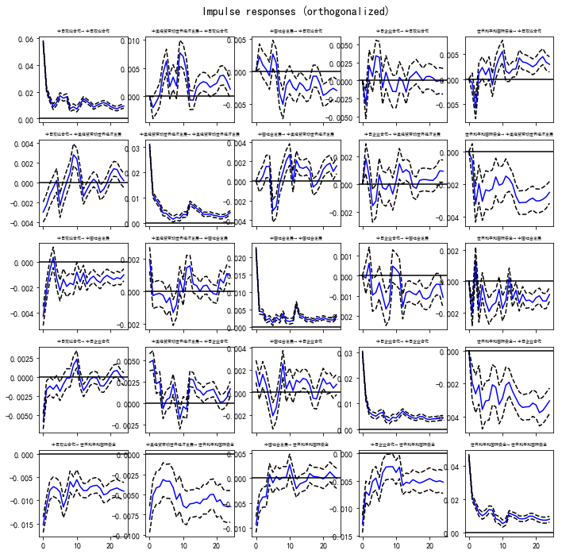
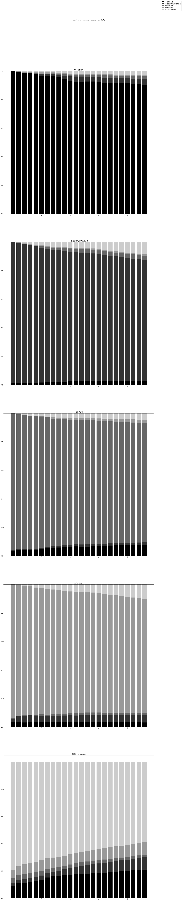

```python
import pandas as pd
import numpy as np
import scipy.sparse as sparse
from numpy import *
import statsmodels.api as sm
import statsmodels.stats.diagnostic
import matplotlib.pyplot as plt
%load_ext blackcellmagic
from statsmodels.tsa.stattools import adfuller
from statsmodels.tsa.stattools import coint
from statsmodels.stats.outliers_influence import variance_inflation_factor
#如遇中文显示问题可加入以下代码
from pylab import mpl
mpl.rcParams['font.sans-serif'] = ['SimHei'] # 指定默认字体
mpl.rcParams['axes.unicode_minus'] = False # 解决保存图像是负号'-'显示为方块的问题
from statsmodels.tsa.vector_ar.vecm import coint_johansen
```

    D:\anaconda3\lib\importlib\_bootstrap.py:219: RuntimeWarning: numpy.ufunc size changed, may indicate binary incompatibility. Expected 216, got 192
      return f(*args, **kwds)
    D:\anaconda3\lib\importlib\_bootstrap.py:219: RuntimeWarning: numpy.ufunc size changed, may indicate binary incompatibility. Expected 192 from C header, got 216 from PyObject
      return f(*args, **kwds)
    

## 导入数据时间+主题分


```python
# import time
df1= pd.read_csv(
    "./data/df_japan.csv",
    header=None,
    encoding="gbk",
    names=["time", "none", "catagory", "title", "content"],
)

# import sparse matrix
lda_score = pd.read_csv("./data/lda_7.csv")

```

### 处理时间口径为月份均值


```python
time_column = pd.to_datetime(df1['time'])
time_column = time_column.dt.to_period("M").dt.to_timestamp()
df2 = pd.concat([time_column, lda_score], axis=1)
df3 = df2.groupby(['time']).agg('mean')
df3.shape
```


    (880, 7)


### 给主题命名，删掉奥运会主题


```python
new_col=["中日双边合作",
    "中美经贸带动世界经济发展",
    "中国社会发展",
    "中日企业合作",
    "中日历史与抗战认识问题",
    "世界和平和国际安全",
    "中国参加奥运会"]
df3.columns=new_col
df4=df3.drop(["中国参加奥运会"],axis=1)
df4.head()
```


<div>
<style scoped>
    .dataframe tbody tr th:only-of-type {
        vertical-align: middle;
    }

    .dataframe tbody tr th {
        vertical-align: top;
    }

    .dataframe thead th {
        text-align: right;
    }
</style>
<table border="1" class="dataframe">
  <thead>
    <tr style="text-align: right;">
      <th></th>
      <th>中日双边合作</th>
      <th>中美经贸带动世界经济发展</th>
      <th>中国社会发展</th>
      <th>中日企业合作</th>
      <th>中日历史与抗战认识问题</th>
      <th>世界和平和国际安全</th>
    </tr>
    <tr>
      <th>time</th>
      <th></th>
      <th></th>
      <th></th>
      <th></th>
      <th></th>
      <th></th>
    </tr>
  </thead>
  <tbody>
    <tr>
      <th>1946-05-01</th>
      <td>0.220377</td>
      <td>0.035148</td>
      <td>0.020722</td>
      <td>0.082530</td>
      <td>0.442255</td>
      <td>0.198229</td>
    </tr>
    <tr>
      <th>1946-06-01</th>
      <td>0.105639</td>
      <td>0.026655</td>
      <td>0.025296</td>
      <td>0.101992</td>
      <td>0.474997</td>
      <td>0.264438</td>
    </tr>
    <tr>
      <th>1946-07-01</th>
      <td>0.103348</td>
      <td>0.022192</td>
      <td>0.019548</td>
      <td>0.041566</td>
      <td>0.495220</td>
      <td>0.316815</td>
    </tr>
    <tr>
      <th>1946-08-01</th>
      <td>0.106302</td>
      <td>0.023587</td>
      <td>0.035205</td>
      <td>0.069731</td>
      <td>0.466334</td>
      <td>0.296444</td>
    </tr>
    <tr>
      <th>1946-09-01</th>
      <td>0.097083</td>
      <td>0.031750</td>
      <td>0.016611</td>
      <td>0.058010</td>
      <td>0.592563</td>
      <td>0.202176</td>
    </tr>
  </tbody>
</table>
</div>


## 单位根检验


```python
t_list = []
name_list = []
p_list = []
for i in df4.columns:
    name_list.append(i)
    test_output = list(adfuller(df4.loc[:,i]))
    t_list.append(test_output[0])
    p_list.append(test_output[1])
    
pd.DataFrame({'name': name_list, 't_value': t_list, 'p_value': p_list})
```


<div>
<style scoped>
    .dataframe tbody tr th:only-of-type {
        vertical-align: middle;
    }

    .dataframe tbody tr th {
        vertical-align: top;
    }

    .dataframe thead th {
        text-align: right;
    }
</style>
<table border="1" class="dataframe">
  <thead>
    <tr style="text-align: right;">
      <th></th>
      <th>name</th>
      <th>t_value</th>
      <th>p_value</th>
    </tr>
  </thead>
  <tbody>
    <tr>
      <th>0</th>
      <td>中日双边合作</td>
      <td>-2.533898</td>
      <td>0.107443</td>
    </tr>
    <tr>
      <th>1</th>
      <td>中美经贸带动世界经济发展</td>
      <td>-0.929277</td>
      <td>0.778178</td>
    </tr>
    <tr>
      <th>2</th>
      <td>中国社会发展</td>
      <td>-1.480002</td>
      <td>0.543380</td>
    </tr>
    <tr>
      <th>3</th>
      <td>中日企业合作</td>
      <td>-1.442794</td>
      <td>0.561597</td>
    </tr>
    <tr>
      <th>4</th>
      <td>中日历史与抗战认识问题</td>
      <td>-5.181652</td>
      <td>0.000010</td>
    </tr>
    <tr>
      <th>5</th>
      <td>世界和平和国际安全</td>
      <td>-1.332795</td>
      <td>0.614038</td>
    </tr>
  </tbody>
</table>
</div>


### 只有‘中日历史与抗战认识问题’是平稳的，因此其余5个做一阶差分


```python
#取一阶差分
df5=df4.drop(["中日历史与抗战认识问题"],axis=1)
df6=df5.diff(periods=1).dropna()
t_list1 = []
name_list1 = []
p_list1 = []
#df5.head()
#单位根检验通过
for i in df6.columns:
    name_list1.append(i)
    test_output = list(adfuller(df6.loc[:, i]))
    t_list1.append(test_output[0])
    p_list1.append(test_output[1])
    
pd.DataFrame({'name': name_list1, 't_value': t_list1, 'p_value': p_list1})

```


<div>
<style scoped>
    .dataframe tbody tr th:only-of-type {
        vertical-align: middle;
    }

    .dataframe tbody tr th {
        vertical-align: top;
    }

    .dataframe thead th {
        text-align: right;
    }
</style>
<table border="1" class="dataframe">
  <thead>
    <tr style="text-align: right;">
      <th></th>
      <th>name</th>
      <th>t_value</th>
      <th>p_value</th>
    </tr>
  </thead>
  <tbody>
    <tr>
      <th>0</th>
      <td>中日双边合作</td>
      <td>-9.458432</td>
      <td>4.420153e-16</td>
    </tr>
    <tr>
      <th>1</th>
      <td>中美经贸带动世界经济发展</td>
      <td>-9.247965</td>
      <td>1.519230e-15</td>
    </tr>
    <tr>
      <th>2</th>
      <td>中国社会发展</td>
      <td>-12.142484</td>
      <td>1.638890e-22</td>
    </tr>
    <tr>
      <th>3</th>
      <td>中日企业合作</td>
      <td>-14.963951</td>
      <td>1.227858e-27</td>
    </tr>
    <tr>
      <th>4</th>
      <td>世界和平和国际安全</td>
      <td>-13.622633</td>
      <td>1.784571e-25</td>
    </tr>
  </tbody>
</table>
</div>


### 一阶差分后平稳，因此做协作检验


```python
'''
#约翰逊协整检验
h0:有0个协整关系
h1:有m个协整关系
以最大特征值对应的特征向量作做为整个系统的协整，默认第一个

'''
# 参数设置常数项滞后一阶
coin1=coint_johansen(df6,0,1) #  有截距项
coin2=coint_johansen(df6,-1,1) # 无确定趋势
coin3=coint_johansen(df6,1,1) # 有确定趋势
```


```python
# 定义一个函数减少重复值
def SUM(coin):
    EIG = pd.DataFrame(coin.eig,index=df6.columns,columns=['Eigenvalue'])
    PV = pd.DataFrame(coin.cvt,index=df6.columns,columns=['10%','5%','1%'])
    LR = pd.DataFrame(coin.lr2,index=df6.columns,columns=['LR'])
    SUM_tol = pd.concat([EIG,LR,PV],axis=1)
    return SUM_tol
```

### 查看协作检验的结果


```python
SUM(coin1)
```


<div>
<style scoped>
    .dataframe tbody tr th:only-of-type {
        vertical-align: middle;
    }

    .dataframe tbody tr th {
        vertical-align: top;
    }

    .dataframe thead th {
        text-align: right;
    }
</style>
<table border="1" class="dataframe">
  <thead>
    <tr style="text-align: right;">
      <th></th>
      <th>Eigenvalue</th>
      <th>LR</th>
      <th>10%</th>
      <th>5%</th>
      <th>1%</th>
    </tr>
  </thead>
  <tbody>
    <tr>
      <th>中日双边合作</th>
      <td>0.578246</td>
      <td>757.143196</td>
      <td>65.8202</td>
      <td>69.8189</td>
      <td>77.8202</td>
    </tr>
    <tr>
      <th>中美经贸带动世界经济发展</th>
      <td>0.559907</td>
      <td>719.815149</td>
      <td>44.4929</td>
      <td>47.8545</td>
      <td>54.6815</td>
    </tr>
    <tr>
      <th>中国社会发展</th>
      <td>0.521854</td>
      <td>647.085475</td>
      <td>27.0669</td>
      <td>29.7961</td>
      <td>35.4628</td>
    </tr>
    <tr>
      <th>中日企业合作</th>
      <td>0.479037</td>
      <td>571.870130</td>
      <td>13.4294</td>
      <td>15.4943</td>
      <td>19.9349</td>
    </tr>
    <tr>
      <th>世界和平和国际安全</th>
      <td>0.472939</td>
      <td>561.665572</td>
      <td>2.7055</td>
      <td>3.8415</td>
      <td>6.6349</td>
    </tr>
  </tbody>
</table>
</div>


```python
SUM(coin2)
```


<div>
<style scoped>
    .dataframe tbody tr th:only-of-type {
        vertical-align: middle;
    }

    .dataframe tbody tr th {
        vertical-align: top;
    }

    .dataframe thead th {
        text-align: right;
    }
</style>
<table border="1" class="dataframe">
  <thead>
    <tr style="text-align: right;">
      <th></th>
      <th>Eigenvalue</th>
      <th>LR</th>
      <th>10%</th>
      <th>5%</th>
      <th>1%</th>
    </tr>
  </thead>
  <tbody>
    <tr>
      <th>中日双边合作</th>
      <td>0.578202</td>
      <td>757.051086</td>
      <td>56.2839</td>
      <td>60.0627</td>
      <td>67.6367</td>
    </tr>
    <tr>
      <th>中美经贸带动世界经济发展</th>
      <td>0.559900</td>
      <td>719.800636</td>
      <td>37.0339</td>
      <td>40.1749</td>
      <td>46.5716</td>
    </tr>
    <tr>
      <th>中国社会发展</th>
      <td>0.521842</td>
      <td>647.062352</td>
      <td>21.7781</td>
      <td>24.2761</td>
      <td>29.5147</td>
    </tr>
    <tr>
      <th>中日企业合作</th>
      <td>0.478999</td>
      <td>571.807608</td>
      <td>10.4741</td>
      <td>12.3212</td>
      <td>16.3640</td>
    </tr>
    <tr>
      <th>世界和平和国际安全</th>
      <td>0.472918</td>
      <td>561.629392</td>
      <td>2.9762</td>
      <td>4.1296</td>
      <td>6.9406</td>
    </tr>
  </tbody>
</table>
</div>


```python
SUM(coin3)
```


<div>
<style scoped>
    .dataframe tbody tr th:only-of-type {
        vertical-align: middle;
    }

    .dataframe tbody tr th {
        vertical-align: top;
    }

    .dataframe thead th {
        text-align: right;
    }
</style>
<table border="1" class="dataframe">
  <thead>
    <tr style="text-align: right;">
      <th></th>
      <th>Eigenvalue</th>
      <th>LR</th>
      <th>10%</th>
      <th>5%</th>
      <th>1%</th>
    </tr>
  </thead>
  <tbody>
    <tr>
      <th>中日双边合作</th>
      <td>0.578283</td>
      <td>757.219165</td>
      <td>75.1027</td>
      <td>79.3422</td>
      <td>87.7748</td>
    </tr>
    <tr>
      <th>中美经贸带动世界经济发展</th>
      <td>0.559931</td>
      <td>719.862689</td>
      <td>51.6492</td>
      <td>55.2459</td>
      <td>62.5202</td>
    </tr>
    <tr>
      <th>中国社会发展</th>
      <td>0.521898</td>
      <td>647.165357</td>
      <td>32.0645</td>
      <td>35.0116</td>
      <td>41.0815</td>
    </tr>
    <tr>
      <th>中日企业合作</th>
      <td>0.479048</td>
      <td>571.889100</td>
      <td>16.1619</td>
      <td>18.3985</td>
      <td>23.1485</td>
    </tr>
    <tr>
      <th>世界和平和国际安全</th>
      <td>0.472924</td>
      <td>561.639472</td>
      <td>2.7055</td>
      <td>3.8415</td>
      <td>6.6349</td>
    </tr>
  </tbody>
</table>
</div>


```python
df6["中日历史与抗战认识问题"]=df5.iloc[-1,4]
```

### 进行OLS回归，需要做6次


```python
def ols(x,y):
    est = sm.OLS(y, sm.add_constant(x)).fit()
    return est.summary()
```


```python
def olsre(df):
    olsr=[]
    for i in df.columns:
        y=df[i]
        x=df.drop([i],axis=1)
        olsr.append(ols(x,y))
    return olsr
```


```python
## 6次ols的结果全部输出，也就是每次其中一个主题做因变量，其余5个做自变量
olsre(df6)
```


    [<class 'statsmodels.iolib.summary.Summary'>
     """
                                 OLS Regression Results                            
     ==============================================================================
     Dep. Variable:                 中日双边合作   R-squared:                       0.177
     Model:                            OLS   Adj. R-squared:                  0.174
     Method:                 Least Squares   F-statistic:                     47.11
     Date:                Thu, 23 Apr 2020   Prob (F-statistic):           6.94e-36
     Time:                        10:55:46   Log-Likelihood:                 1189.8
     No. Observations:                 879   AIC:                            -2370.
     Df Residuals:                     874   BIC:                            -2346.
     Df Model:                           4                                         
     Covariance Type:            nonrobust                                         
     ================================================================================
                        coef    std err          t      P>|t|      [0.025      0.975]
     --------------------------------------------------------------------------------
     中美经贸带动世界经济发展    -0.1462      0.057     -2.548      0.011      -0.259      -0.034
     中国社会发展          -0.4389      0.071     -6.149      0.000      -0.579      -0.299
     中日企业合作          -0.4248      0.058     -7.264      0.000      -0.540      -0.310
     世界和平和国际安全       -0.3895      0.037    -10.492      0.000      -0.462      -0.317
     中日历史与抗战认识问题     -0.0004      0.022     -0.017      0.987      -0.044       0.044
     ==============================================================================
     Omnibus:                       56.452   Durbin-Watson:                   2.787
     Prob(Omnibus):                  0.000   Jarque-Bera (JB):              228.120
     Skew:                          -0.065   Prob(JB):                     2.91e-50
     Kurtosis:                       5.492   Cond. No.                         3.22
     ==============================================================================
     
     Warnings:
     [1] Standard Errors assume that the covariance matrix of the errors is correctly specified.
     """, <class 'statsmodels.iolib.summary.Summary'>
     """
                                 OLS Regression Results                            
     ==============================================================================
     Dep. Variable:           中美经贸带动世界经济发展   R-squared:                       0.034
     Model:                            OLS   Adj. R-squared:                  0.030
     Method:                 Least Squares   F-statistic:                     7.762
     Date:                Thu, 23 Apr 2020   Prob (F-statistic):           3.79e-06
     Time:                        10:55:46   Log-Likelihood:                 1658.1
     No. Observations:                 879   AIC:                            -3306.
     Df Residuals:                     874   BIC:                            -3282.
     Df Model:                           4                                         
     Covariance Type:            nonrobust                                         
     ===============================================================================
                       coef    std err          t      P>|t|      [0.025      0.975]
     -------------------------------------------------------------------------------
     中日双边合作         -0.0504      0.020     -2.548      0.011      -0.089      -0.012
     中国社会发展          0.0754      0.043      1.765      0.078      -0.008       0.159
     中日企业合作          0.0839      0.035      2.381      0.017       0.015       0.153
     世界和平和国际安全      -0.0626      0.023     -2.716      0.007      -0.108      -0.017
     中日历史与抗战认识问题     0.0024      0.013      0.185      0.853      -0.023       0.028
     ==============================================================================
     Omnibus:                       31.418   Durbin-Watson:                   2.788
     Prob(Omnibus):                  0.000   Jarque-Bera (JB):               65.151
     Skew:                           0.197   Prob(JB):                     7.12e-15
     Kurtosis:                       4.274   Cond. No.                         3.28
     ==============================================================================
     
     Warnings:
     [1] Standard Errors assume that the covariance matrix of the errors is correctly specified.
     """, <class 'statsmodels.iolib.summary.Summary'>
     """
                                 OLS Regression Results                            
     ==============================================================================
     Dep. Variable:                 中国社会发展   R-squared:                       0.065
     Model:                            OLS   Adj. R-squared:                  0.061
     Method:                 Least Squares   F-statistic:                     15.18
     Date:                Thu, 23 Apr 2020   Prob (F-statistic):           5.21e-12
     Time:                        10:55:46   Log-Likelihood:                 1864.9
     No. Observations:                 879   AIC:                            -3720.
     Df Residuals:                     874   BIC:                            -3696.
     Df Model:                           4                                         
     Covariance Type:            nonrobust                                         
     ================================================================================
                        coef    std err          t      P>|t|      [0.025      0.975]
     --------------------------------------------------------------------------------
     中日双边合作          -0.0945      0.015     -6.149      0.000      -0.125      -0.064
     中美经贸带动世界经济发展     0.0471      0.027      1.765      0.078      -0.005       0.099
     中日企业合作           0.0280      0.028      1.003      0.316      -0.027       0.083
     世界和平和国际安全       -0.0735      0.018     -4.056      0.000      -0.109      -0.038
     中日历史与抗战认识问题      0.0007      0.010      0.065      0.949      -0.020       0.021
     ==============================================================================
     Omnibus:                       59.590   Durbin-Watson:                   2.976
     Prob(Omnibus):                  0.000   Jarque-Bera (JB):              242.328
     Skew:                          -0.122   Prob(JB):                     2.39e-53
     Kurtosis:                       5.561   Cond. No.                         2.79
     ==============================================================================
     
     Warnings:
     [1] Standard Errors assume that the covariance matrix of the errors is correctly specified.
     """, <class 'statsmodels.iolib.summary.Summary'>
     """
                                 OLS Regression Results                            
     ==============================================================================
     Dep. Variable:                 中日企业合作   R-squared:                       0.103
     Model:                            OLS   Adj. R-squared:                  0.099
     Method:                 Least Squares   F-statistic:                     25.04
     Date:                Thu, 23 Apr 2020   Prob (F-statistic):           1.18e-19
     Time:                        10:55:46   Log-Likelihood:                 1696.8
     No. Observations:                 879   AIC:                            -3384.
     Df Residuals:                     874   BIC:                            -3360.
     Df Model:                           4                                         
     Covariance Type:            nonrobust                                         
     ================================================================================
                        coef    std err          t      P>|t|      [0.025      0.975]
     --------------------------------------------------------------------------------
     中日双边合作          -0.1340      0.018     -7.264      0.000      -0.170      -0.098
     中美经贸带动世界经济发展     0.0768      0.032      2.381      0.017       0.013       0.140
     中国社会发展           0.0410      0.041      1.003      0.316      -0.039       0.121
     世界和平和国际安全       -0.1444      0.022     -6.693      0.000      -0.187      -0.102
     中日历史与抗战认识问题     -0.0002      0.013     -0.012      0.990      -0.025       0.025
     ==============================================================================
     Omnibus:                       62.621   Durbin-Watson:                   2.715
     Prob(Omnibus):                  0.000   Jarque-Bera (JB):              245.708
     Skew:                           0.188   Prob(JB):                     4.42e-54
     Kurtosis:                       5.563   Cond. No.                         3.29
     ==============================================================================
     
     Warnings:
     [1] Standard Errors assume that the covariance matrix of the errors is correctly specified.
     """, <class 'statsmodels.iolib.summary.Summary'>
     """
                                 OLS Regression Results                            
     ==============================================================================
     Dep. Variable:              世界和平和国际安全   R-squared:                       0.147
     Model:                            OLS   Adj. R-squared:                  0.143
     Method:                 Least Squares   F-statistic:                     37.69
     Date:                Thu, 23 Apr 2020   Prob (F-statistic):           4.09e-29
     Time:                        10:55:46   Log-Likelihood:                 1323.8
     No. Observations:                 879   AIC:                            -2638.
     Df Residuals:                     874   BIC:                            -2614.
     Df Model:                           4                                         
     Covariance Type:            nonrobust                                         
     ================================================================================
                        coef    std err          t      P>|t|      [0.025      0.975]
     --------------------------------------------------------------------------------
     中日双边合作          -0.2872      0.027    -10.492      0.000      -0.341      -0.233
     中美经贸带动世界经济发展    -0.1338      0.049     -2.716      0.007      -0.231      -0.037
     中国社会发展          -0.2515      0.062     -4.056      0.000      -0.373      -0.130
     中日企业合作          -0.3375      0.050     -6.693      0.000      -0.436      -0.239
     中日历史与抗战认识问题     -0.0008      0.019     -0.040      0.968      -0.039       0.037
     ==============================================================================
     Omnibus:                       45.075   Durbin-Watson:                   2.713
     Prob(Omnibus):                  0.000   Jarque-Bera (JB):              141.929
     Skew:                           0.118   Prob(JB):                     1.52e-31
     Kurtosis:                       4.954   Cond. No.                         3.25
     ==============================================================================
     
     Warnings:
     [1] Standard Errors assume that the covariance matrix of the errors is correctly specified.
     """, <class 'statsmodels.iolib.summary.Summary'>
     """
                                 OLS Regression Results                            
     ==============================================================================
     Dep. Variable:            中日历史与抗战认识问题   R-squared:                      -0.191
     Model:                            OLS   Adj. R-squared:                 -0.198
     Method:                 Least Squares   F-statistic:                    -28.02
     Date:                Thu, 23 Apr 2020   Prob (F-statistic):               1.00
     Time:                        10:55:46   Log-Likelihood:                 32795.
     No. Observations:                 879   AIC:                        -6.558e+04
     Df Residuals:                     873   BIC:                        -6.555e+04
     Df Model:                           5                                         
     Covariance Type:            nonrobust                                         
     ================================================================================
                        coef    std err          t      P>|t|      [0.025      0.975]
     --------------------------------------------------------------------------------
     const            0.0943   5.13e-19   1.84e+17      0.000       0.094       0.094
     中日双边合作        5.551e-17    8.2e-18      6.768      0.000    3.94e-17    7.16e-17
     中美经贸带动世界经济发展  1.206e-16    1.4e-17      8.629      0.000    9.31e-17    1.48e-16
     中国社会发展        2.515e-17   1.77e-17      1.423      0.155   -9.54e-18    5.98e-17
     中日企业合作        2.429e-17   1.46e-17      1.663      0.097   -4.37e-18    5.29e-17
     世界和平和国际安全     7.318e-18   9.55e-18      0.766      0.444   -1.14e-17    2.61e-17
     ==============================================================================
     Omnibus:                       79.460   Durbin-Watson:                   0.397
     Prob(Omnibus):                  0.000   Jarque-Bera (JB):              458.911
     Skew:                          -0.097   Prob(JB):                    2.23e-100
     Kurtosis:                       6.534   Cond. No.                         34.9
     ==============================================================================
     
     Warnings:
     [1] Standard Errors assume that the covariance matrix of the errors is correctly specified.
     """]


### 滞后3期，查看ols结果


```python
df7=df5.shift(periods=3).dropna()
df7.head(2)
```


<div>
<style scoped>
    .dataframe tbody tr th:only-of-type {
        vertical-align: middle;
    }

    .dataframe tbody tr th {
        vertical-align: top;
    }

    .dataframe thead th {
        text-align: right;
    }
</style>
<table border="1" class="dataframe">
  <thead>
    <tr style="text-align: right;">
      <th></th>
      <th>中日双边合作</th>
      <th>中美经贸带动世界经济发展</th>
      <th>中国社会发展</th>
      <th>中日企业合作</th>
      <th>世界和平和国际安全</th>
    </tr>
    <tr>
      <th>time</th>
      <th></th>
      <th></th>
      <th></th>
      <th></th>
      <th></th>
    </tr>
  </thead>
  <tbody>
    <tr>
      <th>1946-08-01</th>
      <td>0.220377</td>
      <td>0.035148</td>
      <td>0.020722</td>
      <td>0.082530</td>
      <td>0.198229</td>
    </tr>
    <tr>
      <th>1946-09-01</th>
      <td>0.105639</td>
      <td>0.026655</td>
      <td>0.025296</td>
      <td>0.101992</td>
      <td>0.264438</td>
    </tr>
  </tbody>
</table>
</div>


```python
olsre(df7)
```


    [<class 'statsmodels.iolib.summary.Summary'>
     """
                                 OLS Regression Results                            
     ==============================================================================
     Dep. Variable:                 中日双边合作   R-squared:                       0.564
     Model:                            OLS   Adj. R-squared:                  0.562
     Method:                 Least Squares   F-statistic:                     281.9
     Date:                Thu, 23 Apr 2020   Prob (F-statistic):          1.76e-155
     Time:                        10:59:13   Log-Likelihood:                 1002.5
     No. Observations:                 877   AIC:                            -1995.
     Df Residuals:                     872   BIC:                            -1971.
     Df Model:                           4                                         
     Covariance Type:            nonrobust                                         
     ================================================================================
                        coef    std err          t      P>|t|      [0.025      0.975]
     --------------------------------------------------------------------------------
     const            0.5958      0.012     47.719      0.000       0.571       0.620
     中美经贸带动世界经济发展    -0.3758      0.065     -5.775      0.000      -0.504      -0.248
     中国社会发展          -1.0319      0.084    -12.298      0.000      -1.197      -0.867
     中日企业合作          -1.0467      0.058    -17.987      0.000      -1.161      -0.933
     世界和平和国际安全       -0.5757      0.028    -20.441      0.000      -0.631      -0.520
     ==============================================================================
     Omnibus:                       85.228   Durbin-Watson:                   0.828
     Prob(Omnibus):                  0.000   Jarque-Bera (JB):              151.361
     Skew:                          -0.641   Prob(JB):                     1.36e-33
     Kurtosis:                       4.581   Cond. No.                         35.4
     ==============================================================================
     
     Warnings:
     [1] Standard Errors assume that the covariance matrix of the errors is correctly specified.
     """, <class 'statsmodels.iolib.summary.Summary'>
     """
                                 OLS Regression Results                            
     ==============================================================================
     Dep. Variable:           中美经贸带动世界经济发展   R-squared:                       0.726
     Model:                            OLS   Adj. R-squared:                  0.725
     Method:                 Least Squares   F-statistic:                     579.1
     Date:                Thu, 23 Apr 2020   Prob (F-statistic):          1.04e-243
     Time:                        10:59:13   Log-Likelihood:                 1591.7
     No. Observations:                 877   AIC:                            -3173.
     Df Residuals:                     872   BIC:                            -3150.
     Df Model:                           4                                         
     Covariance Type:            nonrobust                                         
     ==============================================================================
                      coef    std err          t      P>|t|      [0.025      0.975]
     ------------------------------------------------------------------------------
     const          0.1152      0.011     10.036      0.000       0.093       0.138
     中日双边合作        -0.0980      0.017     -5.775      0.000      -0.131      -0.065
     中国社会发展         0.3033      0.045      6.700      0.000       0.214       0.392
     中日企业合作         0.2460      0.034      7.281      0.000       0.180       0.312
     世界和平和国际安全     -0.2192      0.016    -13.837      0.000      -0.250      -0.188
     ==============================================================================
     Omnibus:                       57.012   Durbin-Watson:                   0.974
     Prob(Omnibus):                  0.000   Jarque-Bera (JB):               70.796
     Skew:                           0.592   Prob(JB):                     4.23e-16
     Kurtosis:                       3.733   Cond. No.                         37.2
     ==============================================================================
     
     Warnings:
     [1] Standard Errors assume that the covariance matrix of the errors is correctly specified.
     """, <class 'statsmodels.iolib.summary.Summary'>
     """
                                 OLS Regression Results                            
     ==============================================================================
     Dep. Variable:                 中国社会发展   R-squared:                       0.398
     Model:                            OLS   Adj. R-squared:                  0.395
     Method:                 Least Squares   F-statistic:                     144.0
     Date:                Thu, 23 Apr 2020   Prob (F-statistic):           1.62e-94
     Time:                        10:59:13   Log-Likelihood:                 1868.4
     No. Observations:                 877   AIC:                            -3727.
     Df Residuals:                     872   BIC:                            -3703.
     Df Model:                           4                                         
     Covariance Type:            nonrobust                                         
     ================================================================================
                        coef    std err          t      P>|t|      [0.025      0.975]
     --------------------------------------------------------------------------------
     const            0.1010      0.008     12.386      0.000       0.085       0.117
     中日双边合作          -0.1432      0.012    -12.298      0.000      -0.166      -0.120
     中美经贸带动世界经济发展     0.1614      0.024      6.700      0.000       0.114       0.209
     中日企业合作          -0.0504      0.025     -1.988      0.047      -0.100      -0.001
     世界和平和国际安全       -0.0276      0.013     -2.167      0.031      -0.053      -0.003
     ==============================================================================
     Omnibus:                      106.953   Durbin-Watson:                   1.063
     Prob(Omnibus):                  0.000   Jarque-Bera (JB):              168.954
     Skew:                           0.824   Prob(JB):                     2.05e-37
     Kurtosis:                       4.381   Cond. No.                         31.1
     ==============================================================================
     
     Warnings:
     [1] Standard Errors assume that the covariance matrix of the errors is correctly specified.
     """, <class 'statsmodels.iolib.summary.Summary'>
     """
                                 OLS Regression Results                            
     ==============================================================================
     Dep. Variable:                 中日企业合作   R-squared:                       0.799
     Model:                            OLS   Adj. R-squared:                  0.799
     Method:                 Least Squares   F-statistic:                     869.1
     Date:                Thu, 23 Apr 2020   Prob (F-statistic):          1.96e-302
     Time:                        10:59:13   Log-Likelihood:                 1615.7
     No. Observations:                 877   AIC:                            -3221.
     Df Residuals:                     872   BIC:                            -3198.
     Df Model:                           4                                         
     Covariance Type:            nonrobust                                         
     ================================================================================
                        coef    std err          t      P>|t|      [0.025      0.975]
     --------------------------------------------------------------------------------
     const            0.2389      0.009     27.834      0.000       0.222       0.256
     中日双边合作          -0.2585      0.014    -17.987      0.000      -0.287      -0.230
     中美经贸带动世界经济发展     0.2329      0.032      7.281      0.000       0.170       0.296
     中国社会发展          -0.0896      0.045     -1.988      0.047      -0.178      -0.001
     世界和平和国际安全       -0.3206      0.013    -24.452      0.000      -0.346      -0.295
     ==============================================================================
     Omnibus:                        4.556   Durbin-Watson:                   0.920
     Prob(Omnibus):                  0.102   Jarque-Bera (JB):                4.738
     Skew:                          -0.113   Prob(JB):                       0.0936
     Kurtosis:                       3.280   Cond. No.                         37.5
     ==============================================================================
     
     Warnings:
     [1] Standard Errors assume that the covariance matrix of the errors is correctly specified.
     """, <class 'statsmodels.iolib.summary.Summary'>
     """
                                 OLS Regression Results                            
     ==============================================================================
     Dep. Variable:              世界和平和国际安全   R-squared:                       0.787
     Model:                            OLS   Adj. R-squared:                  0.786
     Method:                 Least Squares   F-statistic:                     805.1
     Date:                Thu, 23 Apr 2020   Prob (F-statistic):          5.94e-291
     Time:                        10:59:13   Log-Likelihood:                 1012.5
     No. Observations:                 877   AIC:                            -2015.
     Df Residuals:                     872   BIC:                            -1991.
     Df Model:                           4                                         
     Covariance Type:            nonrobust                                         
     ================================================================================
                        coef    std err          t      P>|t|      [0.025      0.975]
     --------------------------------------------------------------------------------
     const            0.5955      0.012     49.665      0.000       0.572       0.619
     中日双边合作          -0.5627      0.028    -20.441      0.000      -0.617      -0.509
     中美经贸带动世界经济发展    -0.8214      0.059    -13.837      0.000      -0.938      -0.705
     中国社会发展          -0.1942      0.090     -2.167      0.031      -0.370      -0.018
     中日企业合作          -1.2688      0.052    -24.452      0.000      -1.371      -1.167
     ==============================================================================
     Omnibus:                       27.136   Durbin-Watson:                   0.849
     Prob(Omnibus):                  0.000   Jarque-Bera (JB):               39.525
     Skew:                          -0.288   Prob(JB):                     2.61e-09
     Kurtosis:                       3.866   Cond. No.                         37.8
     ==============================================================================
     
     Warnings:
     [1] Standard Errors assume that the covariance matrix of the errors is correctly specified.
     """]


## VECM


```python

vecm_mod=sm.tsa.VECM(df7.loc["1946-08-01":]).fit()
```

    C:\Users\gaowenxin95\AppData\Roaming\Python\Python37\site-packages\statsmodels\tsa\base\tsa_model.py:165: ValueWarning: No frequency information was provided, so inferred frequency MS will be used.
      % freq, ValueWarning)
    


```python
vecm_mod.summary()
```


<table class="simpletable">
<caption>Det. terms outside the coint. relation & lagged endog. parameters for equation 中日双边合作</caption>
<tr>
         <td></td>            <th>coef</th>     <th>std err</th>      <th>z</th>      <th>P>|z|</th>  <th>[0.025</th>    <th>0.975]</th>  
</tr>
<tr>
  <th>L1.中日双边合作</th>       <td>   -0.3435</td> <td>    0.035</td> <td>   -9.920</td> <td> 0.000</td> <td>   -0.411</td> <td>   -0.276</td>
</tr>
<tr>
  <th>L1.中美经贸带动世界经济发展</th> <td>   -0.1112</td> <td>    0.063</td> <td>   -1.764</td> <td> 0.078</td> <td>   -0.235</td> <td>    0.012</td>
</tr>
<tr>
  <th>L1.中国社会发展</th>       <td>    0.2133</td> <td>    0.083</td> <td>    2.560</td> <td> 0.010</td> <td>    0.050</td> <td>    0.377</td>
</tr>
<tr>
  <th>L1.中日企业合作</th>       <td>   -0.1720</td> <td>    0.063</td> <td>   -2.744</td> <td> 0.006</td> <td>   -0.295</td> <td>   -0.049</td>
</tr>
<tr>
  <th>L1.世界和平和国际安全</th>    <td>    0.0327</td> <td>    0.041</td> <td>    0.804</td> <td> 0.421</td> <td>   -0.047</td> <td>    0.112</td>
</tr>
</table>
<table class="simpletable">
<caption>Det. terms outside the coint. relation & lagged endog. parameters for equation 中美经贸带动世界经济发展</caption>
<tr>
         <td></td>            <th>coef</th>     <th>std err</th>      <th>z</th>      <th>P>|z|</th>  <th>[0.025</th>    <th>0.975]</th>  
</tr>
<tr>
  <th>L1.中日双边合作</th>       <td>   -0.0323</td> <td>    0.018</td> <td>   -1.802</td> <td> 0.072</td> <td>   -0.068</td> <td>    0.003</td>
</tr>
<tr>
  <th>L1.中美经贸带动世界经济发展</th> <td>   -0.2955</td> <td>    0.033</td> <td>   -9.046</td> <td> 0.000</td> <td>   -0.360</td> <td>   -0.231</td>
</tr>
<tr>
  <th>L1.中国社会发展</th>       <td>   -0.1343</td> <td>    0.043</td> <td>   -3.112</td> <td> 0.002</td> <td>   -0.219</td> <td>   -0.050</td>
</tr>
<tr>
  <th>L1.中日企业合作</th>       <td>    0.0481</td> <td>    0.032</td> <td>    1.480</td> <td> 0.139</td> <td>   -0.016</td> <td>    0.112</td>
</tr>
<tr>
  <th>L1.世界和平和国际安全</th>    <td>    0.0401</td> <td>    0.021</td> <td>    1.905</td> <td> 0.057</td> <td>   -0.001</td> <td>    0.081</td>
</tr>
</table>
<table class="simpletable">
<caption>Det. terms outside the coint. relation & lagged endog. parameters for equation 中国社会发展</caption>
<tr>
         <td></td>            <th>coef</th>     <th>std err</th>      <th>z</th>      <th>P>|z|</th>  <th>[0.025</th>    <th>0.975]</th>  
</tr>
<tr>
  <th>L1.中日双边合作</th>       <td>   -0.0357</td> <td>    0.014</td> <td>   -2.614</td> <td> 0.009</td> <td>   -0.062</td> <td>   -0.009</td>
</tr>
<tr>
  <th>L1.中美经贸带动世界经济发展</th> <td>   -0.0953</td> <td>    0.025</td> <td>   -3.830</td> <td> 0.000</td> <td>   -0.144</td> <td>   -0.047</td>
</tr>
<tr>
  <th>L1.中国社会发展</th>       <td>   -0.3816</td> <td>    0.033</td> <td>  -11.614</td> <td> 0.000</td> <td>   -0.446</td> <td>   -0.317</td>
</tr>
<tr>
  <th>L1.中日企业合作</th>       <td>   -0.0348</td> <td>    0.025</td> <td>   -1.406</td> <td> 0.160</td> <td>   -0.083</td> <td>    0.014</td>
</tr>
<tr>
  <th>L1.世界和平和国际安全</th>    <td>   -0.0767</td> <td>    0.016</td> <td>   -4.787</td> <td> 0.000</td> <td>   -0.108</td> <td>   -0.045</td>
</tr>
</table>
<table class="simpletable">
<caption>Det. terms outside the coint. relation & lagged endog. parameters for equation 中日企业合作</caption>
<tr>
         <td></td>            <th>coef</th>     <th>std err</th>      <th>z</th>      <th>P>|z|</th>  <th>[0.025</th>    <th>0.975]</th>  
</tr>
<tr>
  <th>L1.中日双边合作</th>       <td>    0.0045</td> <td>    0.019</td> <td>    0.243</td> <td> 0.808</td> <td>   -0.032</td> <td>    0.041</td>
</tr>
<tr>
  <th>L1.中美经贸带动世界经济发展</th> <td>    0.0981</td> <td>    0.034</td> <td>    2.881</td> <td> 0.004</td> <td>    0.031</td> <td>    0.165</td>
</tr>
<tr>
  <th>L1.中国社会发展</th>       <td>   -0.0402</td> <td>    0.045</td> <td>   -0.893</td> <td> 0.372</td> <td>   -0.128</td> <td>    0.048</td>
</tr>
<tr>
  <th>L1.中日企业合作</th>       <td>   -0.3288</td> <td>    0.034</td> <td>   -9.713</td> <td> 0.000</td> <td>   -0.395</td> <td>   -0.262</td>
</tr>
<tr>
  <th>L1.世界和平和国际安全</th>    <td>   -0.0081</td> <td>    0.022</td> <td>   -0.371</td> <td> 0.711</td> <td>   -0.051</td> <td>    0.035</td>
</tr>
</table>
<table class="simpletable">
<caption>Det. terms outside the coint. relation & lagged endog. parameters for equation 世界和平和国际安全</caption>
<tr>
         <td></td>            <th>coef</th>     <th>std err</th>      <th>z</th>      <th>P>|z|</th>  <th>[0.025</th>    <th>0.975]</th>  
</tr>
<tr>
  <th>L1.中日双边合作</th>       <td>   -0.0743</td> <td>    0.029</td> <td>   -2.527</td> <td> 0.011</td> <td>   -0.132</td> <td>   -0.017</td>
</tr>
<tr>
  <th>L1.中美经贸带动世界经济发展</th> <td>    0.0833</td> <td>    0.054</td> <td>    1.556</td> <td> 0.120</td> <td>   -0.022</td> <td>    0.188</td>
</tr>
<tr>
  <th>L1.中国社会发展</th>       <td>   -0.1785</td> <td>    0.071</td> <td>   -2.525</td> <td> 0.012</td> <td>   -0.317</td> <td>   -0.040</td>
</tr>
<tr>
  <th>L1.中日企业合作</th>       <td>    0.0120</td> <td>    0.053</td> <td>    0.225</td> <td> 0.822</td> <td>   -0.092</td> <td>    0.116</td>
</tr>
<tr>
  <th>L1.世界和平和国际安全</th>    <td>   -0.3330</td> <td>    0.034</td> <td>   -9.667</td> <td> 0.000</td> <td>   -0.401</td> <td>   -0.265</td>
</tr>
</table>
<table class="simpletable">
<caption>Loading coefficients (alpha) for equation 中日双边合作</caption>
<tr>
   <td></td>      <th>coef</th>     <th>std err</th>      <th>z</th>      <th>P>|z|</th>  <th>[0.025</th>    <th>0.975]</th>  
</tr>
<tr>
  <th>ec1</th> <td>   -0.0138</td> <td>    0.006</td> <td>   -2.385</td> <td> 0.017</td> <td>   -0.025</td> <td>   -0.002</td>
</tr>
</table>
<table class="simpletable">
<caption>Loading coefficients (alpha) for equation 中美经贸带动世界经济发展</caption>
<tr>
   <td></td>      <th>coef</th>     <th>std err</th>      <th>z</th>      <th>P>|z|</th>  <th>[0.025</th>    <th>0.975]</th>  
</tr>
<tr>
  <th>ec1</th> <td>    0.0241</td> <td>    0.003</td> <td>    8.051</td> <td> 0.000</td> <td>    0.018</td> <td>    0.030</td>
</tr>
</table>
<table class="simpletable">
<caption>Loading coefficients (alpha) for equation 中国社会发展</caption>
<tr>
   <td></td>      <th>coef</th>     <th>std err</th>      <th>z</th>      <th>P>|z|</th>  <th>[0.025</th>    <th>0.975]</th>  
</tr>
<tr>
  <th>ec1</th> <td>   -0.0181</td> <td>    0.002</td> <td>   -7.961</td> <td> 0.000</td> <td>   -0.023</td> <td>   -0.014</td>
</tr>
</table>
<table class="simpletable">
<caption>Loading coefficients (alpha) for equation 中日企业合作</caption>
<tr>
   <td></td>      <th>coef</th>     <th>std err</th>      <th>z</th>      <th>P>|z|</th>  <th>[0.025</th>    <th>0.975]</th>  
</tr>
<tr>
  <th>ec1</th> <td>    0.0043</td> <td>    0.003</td> <td>    1.384</td> <td> 0.166</td> <td>   -0.002</td> <td>    0.010</td>
</tr>
</table>
<table class="simpletable">
<caption>Loading coefficients (alpha) for equation 世界和平和国际安全</caption>
<tr>
   <td></td>      <th>coef</th>     <th>std err</th>      <th>z</th>      <th>P>|z|</th>  <th>[0.025</th>    <th>0.975]</th>  
</tr>
<tr>
  <th>ec1</th> <td>    0.0194</td> <td>    0.005</td> <td>    3.957</td> <td> 0.000</td> <td>    0.010</td> <td>    0.029</td>
</tr>
</table>
<table class="simpletable">
<caption>Cointegration relations for loading-coefficients-column 1</caption>
<tr>
     <td></td>       <th>coef</th>     <th>std err</th>      <th>z</th>      <th>P>|z|</th>  <th>[0.025</th>    <th>0.975]</th>  
</tr>
<tr>
  <th>beta.1</th> <td>    1.0000</td> <td>        0</td> <td>        0</td> <td> 0.000</td> <td>    1.000</td> <td>    1.000</td>
</tr>
<tr>
  <th>beta.2</th> <td>   -7.8053</td> <td>    0.757</td> <td>  -10.306</td> <td> 0.000</td> <td>   -9.290</td> <td>   -6.321</td>
</tr>
<tr>
  <th>beta.3</th> <td>   12.5047</td> <td>    1.023</td> <td>   12.219</td> <td> 0.000</td> <td>   10.499</td> <td>   14.510</td>
</tr>
<tr>
  <th>beta.4</th> <td>    0.5206</td> <td>    0.580</td> <td>    0.898</td> <td> 0.369</td> <td>   -0.615</td> <td>    1.656</td>
</tr>
<tr>
  <th>beta.5</th> <td>   -2.0132</td> <td>    0.159</td> <td>  -12.634</td> <td> 0.000</td> <td>   -2.325</td> <td>   -1.701</td>
</tr>
</table>


## VAR 模型


```python
var_mod = sm.tsa.VAR(df7.loc["1946-08-01":]).fit( ic='aic')
```

    C:\Users\gaowenxin95\AppData\Roaming\Python\Python37\site-packages\statsmodels\tsa\base\tsa_model.py:165: ValueWarning: No frequency information was provided, so inferred frequency MS will be used.
      % freq, ValueWarning)
    


```python
var_mod.summary()
```


      Summary of Regression Results   
    ==================================
    Model:                         VAR
    Method:                        OLS
    Date:           Thu, 23, Apr, 2020
    Time:                     11:25:25
    --------------------------------------------------------------------
    No. of Equations:         5.00000    BIC:                   -31.4682
    Nobs:                     865.000    HQIC:                  -32.5048
    Log likelihood:           8504.40    FPE:                4.02456e-15
    AIC:                     -33.1475    Det(Omega_mle):     2.86249e-15
    --------------------------------------------------------------------
    Results for equation 中日双边合作
    ===================================================================================
                          coefficient       std. error           t-stat            prob
    -----------------------------------------------------------------------------------
    const                   -0.014379         0.028747           -0.500           0.617
    L1.中日双边合作                0.368461         0.039315            9.372           0.000
    L1.中美经贸带动世界经济发展         -0.058140         0.066274           -0.877           0.380
    L1.中国社会发展                0.105391         0.089253            1.181           0.238
    L1.中日企业合作               -0.117416         0.069469           -1.690           0.091
    L1.世界和平和国际安全            -0.016073         0.043252           -0.372           0.710
    L2.中日双边合作                0.082735         0.041495            1.994           0.046
    L2.中美经贸带动世界经济发展         -0.011180         0.070128           -0.159           0.873
    L2.中国社会发展               -0.072472         0.091135           -0.795           0.426
    L2.中日企业合作                0.109258         0.073801            1.480           0.139
    L2.世界和平和国际安全            -0.114078         0.046973           -2.429           0.015
    L3.中日双边合作                0.039092         0.041754            0.936           0.349
    L3.中美经贸带动世界经济发展          0.046358         0.070551            0.657           0.511
    L3.中国社会发展                0.010765         0.093381            0.115           0.908
    L3.中日企业合作                0.002740         0.074111            0.037           0.971
    L3.世界和平和国际安全             0.118066         0.047676            2.476           0.013
    L4.中日双边合作                0.154442         0.041538            3.718           0.000
    L4.中美经贸带动世界经济发展          0.135160         0.070573            1.915           0.055
    L4.中国社会发展               -0.027623         0.093061           -0.297           0.767
    L4.中日企业合作                0.118243         0.074381            1.590           0.112
    L4.世界和平和国际安全             0.048343         0.048059            1.006           0.314
    L5.中日双边合作                0.169085         0.041715            4.053           0.000
    L5.中美经贸带动世界经济发展          0.072396         0.070943            1.020           0.308
    L5.中国社会发展                0.103396         0.093392            1.107           0.268
    L5.中日企业合作                0.024549         0.074230            0.331           0.741
    L5.世界和平和国际安全            -0.027788         0.048047           -0.578           0.563
    L6.中日双边合作                0.051304         0.042062            1.220           0.223
    L6.中美经贸带动世界经济发展         -0.054249         0.071044           -0.764           0.445
    L6.中国社会发展                0.012181         0.094675            0.129           0.898
    L6.中日企业合作               -0.071119         0.074443           -0.955           0.339
    L6.世界和平和国际安全             0.076882         0.048133            1.597           0.110
    L7.中日双边合作                0.058105         0.041900            1.387           0.166
    L7.中美经贸带动世界经济发展          0.056858         0.071058            0.800           0.424
    L7.中国社会发展               -0.261441         0.094718           -2.760           0.006
    L7.中日企业合作                0.033951         0.074752            0.454           0.650
    L7.世界和平和国际安全            -0.046689         0.048049           -0.972           0.331
    L8.中日双边合作               -0.103445         0.041613           -2.486           0.013
    L8.中美经贸带动世界经济发展         -0.015589         0.070613           -0.221           0.825
    L8.中国社会发展               -0.105690         0.095056           -1.112           0.266
    L8.中日企业合作               -0.018767         0.074613           -0.252           0.801
    L8.世界和平和国际安全             0.060989         0.047821            1.275           0.202
    L9.中日双边合作                0.059838         0.041444            1.444           0.149
    L9.中美经贸带动世界经济发展          0.158417         0.070610            2.244           0.025
    L9.中国社会发展                0.132759         0.095200            1.395           0.163
    L9.中日企业合作               -0.061546         0.074339           -0.828           0.408
    L9.世界和平和国际安全             0.054926         0.047800            1.149           0.251
    L10.中日双边合作               0.002351         0.041469            0.057           0.955
    L10.中美经贸带动世界经济发展         0.009516         0.070744            0.135           0.893
    L10.中国社会发展               0.031823         0.095041            0.335           0.738
    L10.中日企业合作              -0.019911         0.074424           -0.268           0.789
    L10.世界和平和国际安全           -0.005715         0.047816           -0.120           0.905
    L11.中日双边合作               0.010549         0.041081            0.257           0.797
    L11.中美经贸带动世界经济发展        -0.047015         0.070081           -0.671           0.502
    L11.中国社会发展              -0.060416         0.093158           -0.649           0.517
    L11.中日企业合作               0.041121         0.074169            0.554           0.579
    L11.世界和平和国际安全           -0.044413         0.047543           -0.934           0.350
    L12.中日双边合作               0.065033         0.039333            1.653           0.098
    L12.中美经贸带动世界经济发展        -0.171257         0.065965           -2.596           0.009
    L12.中国社会发展              -0.062951         0.091152           -0.691           0.490
    L12.中日企业合作               0.013477         0.069778            0.193           0.847
    L12.世界和平和国际安全           -0.013208         0.043177           -0.306           0.760
    ===================================================================================
    
    Results for equation 中美经贸带动世界经济发展
    ===================================================================================
                          coefficient       std. error           t-stat            prob
    -----------------------------------------------------------------------------------
    const                    0.041503         0.015567            2.666           0.008
    L1.中日双边合作               -0.019900         0.021289           -0.935           0.350
    L1.中美经贸带动世界经济发展          0.349806         0.035888            9.747           0.000
    L1.中国社会发展               -0.013196         0.048331           -0.273           0.785
    L1.中日企业合作                0.055623         0.037618            1.479           0.139
    L1.世界和平和国际安全            -0.012148         0.023421           -0.519           0.604
    L2.中日双边合作               -0.014901         0.022470           -0.663           0.507
    L2.中美经贸带动世界经济发展          0.145172         0.037975            3.823           0.000
    L2.中国社会发展                0.002154         0.049350            0.044           0.965
    L2.中日企业合作               -0.055924         0.039964           -1.399           0.162
    L2.世界和平和国际安全            -0.059469         0.025436           -2.338           0.019
    L3.中日双边合作                0.006125         0.022610            0.271           0.786
    L3.中美经贸带动世界经济发展          0.078391         0.038204            2.052           0.040
    L3.中国社会发展                0.057560         0.050566            1.138           0.255
    L3.中日企业合作               -0.068367         0.040132           -1.704           0.088
    L3.世界和平和国际安全             0.013168         0.025817            0.510           0.610
    L4.中日双边合作                0.002421         0.022493            0.108           0.914
    L4.中美经贸带动世界经济发展         -0.022309         0.038216           -0.584           0.559
    L4.中国社会发展                0.017193         0.050393            0.341           0.733
    L4.中日企业合作               -0.023036         0.040278           -0.572           0.567
    L4.世界和平和国际安全            -0.025033         0.026024           -0.962           0.336
    L5.中日双边合作               -0.054231         0.022589           -2.401           0.016
    L5.中美经贸带动世界经济发展          0.040919         0.038416            1.065           0.287
    L5.中国社会发展               -0.191359         0.050572           -3.784           0.000
    L5.中日企业合作                0.058347         0.040196            1.452           0.147
    L5.世界和平和国际安全             0.006356         0.026018            0.244           0.807
    L6.中日双边合作               -0.003566         0.022777           -0.157           0.876
    L6.中美经贸带动世界经济发展         -0.016225         0.038471           -0.422           0.673
    L6.中国社会发展               -0.040820         0.051267           -0.796           0.426
    L6.中日企业合作               -0.038692         0.040311           -0.960           0.337
    L6.世界和平和国际安全            -0.013666         0.026065           -0.524           0.600
    L7.中日双边合作                0.020847         0.022689            0.919           0.358
    L7.中美经贸带动世界经济发展         -0.021668         0.038478           -0.563           0.573
    L7.中国社会发展                0.073688         0.051290            1.437           0.151
    L7.中日企业合作               -0.001424         0.040479           -0.035           0.972
    L7.世界和平和国际安全             0.002363         0.026019            0.091           0.928
    L8.中日双边合作                0.030048         0.022533            1.333           0.182
    L8.中美经贸带动世界经济发展          0.026685         0.038237            0.698           0.485
    L8.中国社会发展                0.066720         0.051473            1.296           0.195
    L8.中日企业合作                0.021694         0.040403            0.537           0.591
    L8.世界和平和国际安全             0.012424         0.025895            0.480           0.631
    L9.中日双边合作                0.037371         0.022442            1.665           0.096
    L9.中美经贸带动世界经济发展          0.025730         0.038236            0.673           0.501
    L9.中国社会发展                0.054764         0.051552            1.062           0.288
    L9.中日企业合作               -0.017891         0.040255           -0.444           0.657
    L9.世界和平和国际安全            -0.000017         0.025884           -0.001           0.999
    L10.中日双边合作               0.017190         0.022456            0.765           0.444
    L10.中美经贸带动世界经济发展         0.070024         0.038308            1.828           0.068
    L10.中国社会发展               0.074582         0.051465            1.449           0.147
    L10.中日企业合作               0.023522         0.040301            0.584           0.559
    L10.世界和平和国际安全            0.000782         0.025892            0.030           0.976
    L11.中日双边合作              -0.023164         0.022246           -1.041           0.298
    L11.中美经贸带动世界经济发展         0.011881         0.037949            0.313           0.754
    L11.中国社会发展              -0.071680         0.050446           -1.421           0.155
    L11.中日企业合作               0.033719         0.040163            0.840           0.401
    L11.世界和平和国际安全            0.011411         0.025745            0.443           0.658
    L12.中日双边合作              -0.029781         0.021299           -1.398           0.162
    L12.中美经贸带动世界经济发展         0.128340         0.035721            3.593           0.000
    L12.中国社会发展               0.057701         0.049359            1.169           0.242
    L12.中日企业合作              -0.023744         0.037785           -0.628           0.530
    L12.世界和平和国际安全           -0.015260         0.023381           -0.653           0.514
    ===================================================================================
    
    Results for equation 中国社会发展
    ===================================================================================
                          coefficient       std. error           t-stat            prob
    -----------------------------------------------------------------------------------
    const                    0.036435         0.011553            3.154           0.002
    L1.中日双边合作               -0.040914         0.015800           -2.589           0.010
    L1.中美经贸带动世界经济发展         -0.029157         0.026635           -1.095           0.274
    L1.中国社会发展                0.184647         0.035870            5.148           0.000
    L1.中日企业合作               -0.022931         0.027919           -0.821           0.411
    L1.世界和平和国际安全            -0.044566         0.017383           -2.564           0.010
    L2.中日双边合作                0.033114         0.016676            1.986           0.047
    L2.中美经贸带动世界经济发展         -0.003073         0.028184           -0.109           0.913
    L2.中国社会发展                0.170268         0.036626            4.649           0.000
    L2.中日企业合作                0.041971         0.029660            1.415           0.157
    L2.世界和平和国际安全             0.056150         0.018878            2.974           0.003
    L3.中日双边合作               -0.002066         0.016781           -0.123           0.902
    L3.中美经贸带动世界经济发展          0.001674         0.028354            0.059           0.953
    L3.中国社会发展                0.006020         0.037529            0.160           0.873
    L3.中日企业合作               -0.061412         0.029785           -2.062           0.039
    L3.世界和平和国际安全            -0.053014         0.019161           -2.767           0.006
    L4.中日双边合作               -0.024555         0.016694           -1.471           0.141
    L4.中美经贸带动世界经济发展          0.005032         0.028363            0.177           0.859
    L4.中国社会发展                0.058072         0.037400            1.553           0.120
    L4.中日企业合作               -0.007979         0.029893           -0.267           0.790
    L4.世界和平和国际安全             0.014594         0.019314            0.756           0.450
    L5.中日双边合作               -0.029363         0.016765           -1.751           0.080
    L5.中美经贸带动世界经济发展         -0.019562         0.028512           -0.686           0.493
    L5.中国社会发展                0.010703         0.037533            0.285           0.776
    L5.中日企业合作               -0.002179         0.029833           -0.073           0.942
    L5.世界和平和国际安全            -0.016351         0.019310           -0.847           0.397
    L6.中日双边合作               -0.006071         0.016904           -0.359           0.719
    L6.中美经贸带动世界经济发展         -0.002299         0.028552           -0.081           0.936
    L6.中国社会发展                0.068654         0.038049            1.804           0.071
    L6.中日企业合作               -0.037754         0.029918           -1.262           0.207
    L6.世界和平和国际安全            -0.029415         0.019344           -1.521           0.128
    L7.中日双边合作               -0.024232         0.016839           -1.439           0.150
    L7.中美经贸带动世界经济发展         -0.033651         0.028558           -1.178           0.239
    L7.中国社会发展                0.032492         0.038066            0.854           0.393
    L7.中日企业合作               -0.032715         0.030042           -1.089           0.276
    L7.世界和平和国际安全             0.000602         0.019311            0.031           0.975
    L8.中日双边合作               -0.000676         0.016724           -0.040           0.968
    L8.中美经贸带动世界经济发展          0.001704         0.028379            0.060           0.952
    L8.中国社会发展                0.086670         0.038202            2.269           0.023
    L8.中日企业合作               -0.012890         0.029986           -0.430           0.667
    L8.世界和平和国际安全            -0.006483         0.019219           -0.337           0.736
    L9.中日双边合作                0.002693         0.016656            0.162           0.872
    L9.中美经贸带动世界经济发展          0.046737         0.028378            1.647           0.100
    L9.中国社会发展                0.001742         0.038260            0.046           0.964
    L9.中日企业合作                0.069462         0.029876            2.325           0.020
    L9.世界和平和国际安全             0.014703         0.019211            0.765           0.444
    L10.中日双边合作               0.010719         0.016666            0.643           0.520
    L10.中美经贸带动世界经济发展        -0.003409         0.028432           -0.120           0.905
    L10.中国社会发展              -0.006718         0.038196           -0.176           0.860
    L10.中日企业合作              -0.003679         0.029911           -0.123           0.902
    L10.世界和平和国际安全           -0.018154         0.019217           -0.945           0.345
    L11.中日双边合作               0.001107         0.016510            0.067           0.947
    L11.中美经贸带动世界经济发展         0.039197         0.028165            1.392           0.164
    L11.中国社会发展               0.037486         0.037439            1.001           0.317
    L11.中日企业合作               0.005355         0.029808            0.180           0.857
    L11.世界和平和国际安全            0.008005         0.019107            0.419           0.675
    L12.中日双边合作               0.034587         0.015808            2.188           0.029
    L12.中美经贸带动世界经济发展         0.021341         0.026511            0.805           0.421
    L12.中国社会发展               0.215304         0.036633            5.877           0.000
    L12.中日企业合作              -0.016877         0.028043           -0.602           0.547
    L12.世界和平和国际安全            0.038191         0.017353            2.201           0.028
    ===================================================================================
    
    Results for equation 中日企业合作
    ===================================================================================
                          coefficient       std. error           t-stat            prob
    -----------------------------------------------------------------------------------
    const                    0.050930         0.015608            3.263           0.001
    L1.中日双边合作                0.001845         0.021346            0.086           0.931
    L1.中美经贸带动世界经济发展          0.093472         0.035983            2.598           0.009
    L1.中国社会发展               -0.028120         0.048460           -0.580           0.562
    L1.中日企业合作                0.390424         0.037718           10.351           0.000
    L1.世界和平和国际安全            -0.042451         0.023483           -1.808           0.071
    L2.中日双边合作               -0.016856         0.022529           -0.748           0.454
    L2.中美经贸带动世界经济发展         -0.044909         0.038076           -1.179           0.238
    L2.中国社会发展                0.047698         0.049481            0.964           0.335
    L2.中日企业合作                0.036391         0.040070            0.908           0.364
    L2.世界和平和国际安全            -0.021182         0.025504           -0.831           0.406
    L3.中日双边合作               -0.010697         0.022670           -0.472           0.637
    L3.中美经贸带动世界经济发展          0.019682         0.038306            0.514           0.607
    L3.中国社会发展               -0.015231         0.050701           -0.300           0.764
    L3.中日企业合作                0.073399         0.040238            1.824           0.068
    L3.世界和平和国际安全             0.012347         0.025886            0.477           0.633
    L4.中日双边合作               -0.022200         0.022553           -0.984           0.325
    L4.中美经贸带动世界经济发展         -0.102918         0.038317           -2.686           0.007
    L4.中国社会发展               -0.083661         0.050527           -1.656           0.098
    L4.中日企业合作                0.029182         0.040385            0.723           0.470
    L4.世界和平和国际安全            -0.046214         0.026093           -1.771           0.077
    L5.中日双边合作               -0.029146         0.022649           -1.287           0.198
    L5.中美经贸带动世界经济发展          0.013092         0.038518            0.340           0.734
    L5.中国社会发展               -0.087266         0.050707           -1.721           0.085
    L5.中日企业合作                0.092108         0.040303            2.285           0.022
    L5.世界和平和国际安全             0.003839         0.026087            0.147           0.883
    L6.中日双边合作                0.011061         0.022837            0.484           0.628
    L6.中美经贸带动世界经济发展         -0.015283         0.038573           -0.396           0.692
    L6.中国社会发展                0.006255         0.051403            0.122           0.903
    L6.中日企业合作                0.050344         0.040418            1.246           0.213
    L6.世界和平和国际安全            -0.010080         0.026134           -0.386           0.700
    L7.中日双边合作                0.019449         0.022749            0.855           0.393
    L7.中美经贸带动世界经济发展          0.066156         0.038581            1.715           0.086
    L7.中国社会发展                0.079047         0.051426            1.537           0.124
    L7.中日企业合作               -0.026962         0.040586           -0.664           0.506
    L7.世界和平和国际安全             0.025528         0.026088            0.979           0.328
    L8.中日双边合作                0.011804         0.022593            0.522           0.601
    L8.中美经贸带动世界经济发展         -0.047610         0.038339           -1.242           0.214
    L8.中国社会发展                0.121300         0.051610            2.350           0.019
    L8.中日企业合作                0.001018         0.040511            0.025           0.980
    L8.世界和平和国际安全             0.002964         0.025964            0.114           0.909
    L9.中日双边合作                0.019720         0.022502            0.876           0.381
    L9.中美经贸带动世界经济发展         -0.070885         0.038338           -1.849           0.064
    L9.中国社会发展               -0.073736         0.051689           -1.427           0.154
    L9.中日企业合作                0.055885         0.040362            1.385           0.166
    L9.世界和平和国际安全            -0.017370         0.025953           -0.669           0.503
    L10.中日双边合作               0.011318         0.022515            0.503           0.615
    L10.中美经贸带动世界经济发展         0.015754         0.038410            0.410           0.682
    L10.中国社会发展               0.018494         0.051602            0.358           0.720
    L10.中日企业合作               0.016795         0.040408            0.416           0.678
    L10.世界和平和国际安全           -0.004402         0.025961           -0.170           0.865
    L11.中日双边合作              -0.031048         0.022305           -1.392           0.164
    L11.中美经贸带动世界经济发展        -0.034812         0.038050           -0.915           0.360
    L11.中国社会发展              -0.020507         0.050580           -0.405           0.685
    L11.中日企业合作               0.058557         0.040270            1.454           0.146
    L11.世界和平和国际安全            0.020219         0.025813            0.783           0.433
    L12.中日双边合作              -0.010584         0.021356           -0.496           0.620
    L12.中美经贸带动世界经济发展         0.079329         0.035815            2.215           0.027
    L12.中国社会发展               0.054658         0.049490            1.104           0.269
    L12.中日企业合作               0.057651         0.037886            1.522           0.128
    L12.世界和平和国际安全           -0.003866         0.023443           -0.165           0.869
    ===================================================================================
    
    Results for equation 世界和平和国际安全
    ===================================================================================
                          coefficient       std. error           t-stat            prob
    -----------------------------------------------------------------------------------
    const                    0.051958         0.026065            1.993           0.046
    L1.中日双边合作               -0.082611         0.035646           -2.318           0.020
    L1.中美经贸带动世界经济发展         -0.038763         0.060090           -0.645           0.519
    L1.中国社会发展               -0.031522         0.080925           -0.390           0.697
    L1.中日企业合作               -0.038813         0.062987           -0.616           0.538
    L1.世界和平和国际安全             0.453363         0.039216           11.561           0.000
    L2.中日双边合作                0.011977         0.037623            0.318           0.750
    L2.中美经贸带动世界经济发展          0.004187         0.063584            0.066           0.947
    L2.中国社会发展                0.013772         0.082631            0.167           0.868
    L2.中日企业合作               -0.078761         0.066915           -1.177           0.239
    L2.世界和平和国际安全             0.147311         0.042590            3.459           0.001
    L3.中日双边合作               -0.017490         0.037858           -0.462           0.644
    L3.中美经贸带动世界经济发展         -0.020306         0.063968           -0.317           0.751
    L3.中国社会发展               -0.043505         0.084667           -0.514           0.607
    L3.中日企业合作                0.033351         0.067196            0.496           0.620
    L3.世界和平和国际安全             0.012927         0.043227            0.299           0.765
    L4.中日双边合作               -0.017808         0.037662           -0.473           0.636
    L4.中美经贸带动世界经济发展         -0.003044         0.063988           -0.048           0.962
    L4.中国社会发展                0.174616         0.084377            2.069           0.039
    L4.中日企业合作               -0.010408         0.067441           -0.154           0.877
    L4.世界和平和国际安全             0.035461         0.043574            0.814           0.416
    L5.中日双边合作               -0.007712         0.037823           -0.204           0.838
    L5.中美经贸带动世界经济发展          0.022429         0.064324            0.349           0.727
    L5.中国社会发展               -0.004352         0.084677           -0.051           0.959
    L5.中日企业合作               -0.048285         0.067304           -0.717           0.473
    L5.世界和平和国际安全             0.092644         0.043563            2.127           0.033
    L6.中日双边合作               -0.027810         0.038137           -0.729           0.466
    L6.中美经贸带动世界经济发展         -0.001834         0.064415           -0.028           0.977
    L6.中国社会发展                0.054209         0.085841            0.632           0.528
    L6.中日企业合作                0.106828         0.067496            1.583           0.113
    L6.世界和平和国际安全             0.075305         0.043642            1.726           0.084
    L7.中日双边合作                0.032802         0.037990            0.863           0.388
    L7.中美经贸带动世界经济发展         -0.042579         0.064427           -0.661           0.509
    L7.中国社会发展                0.016196         0.085879            0.189           0.850
    L7.中日企业合作                0.056729         0.067777            0.837           0.403
    L7.世界和平和国际安全             0.045829         0.043566            1.052           0.293
    L8.中日双边合作                0.033751         0.037730            0.895           0.371
    L8.中美经贸带动世界经济发展         -0.067791         0.064024           -1.059           0.290
    L8.中国社会发展               -0.043205         0.086186           -0.501           0.616
    L8.中日企业合作               -0.012162         0.067650           -0.180           0.857
    L8.世界和平和国际安全            -0.087856         0.043358           -2.026           0.043
    L9.中日双边合作               -0.024953         0.037577           -0.664           0.507
    L9.中美经贸带动世界经济发展          0.012966         0.064021            0.203           0.840
    L9.中国社会发展               -0.008972         0.086317           -0.104           0.917
    L9.中日企业合作                0.002517         0.067402            0.037           0.970
    L9.世界和平和国际安全             0.017940         0.043340            0.414           0.679
    L10.中日双边合作               0.032904         0.037599            0.875           0.382
    L10.中美经贸带动世界经济发展        -0.041889         0.064143           -0.653           0.514
    L10.中国社会发展               0.109071         0.086172            1.266           0.206
    L10.中日企业合作              -0.053618         0.067480           -0.795           0.427
    L10.世界和平和国际安全           -0.013573         0.043354           -0.313           0.754
    L11.中日双边合作               0.001160         0.037248            0.031           0.975
    L11.中美经贸带动世界经济发展        -0.004067         0.063541           -0.064           0.949
    L11.中国社会发展              -0.070180         0.084465           -0.831           0.406
    L11.中日企业合作               0.040090         0.067248            0.596           0.551
    L11.世界和平和国际安全            0.022937         0.043106            0.532           0.595
    L12.中日双边合作              -0.002452         0.035663           -0.069           0.945
    L12.中美经贸带动世界经济发展         0.047577         0.059810            0.795           0.426
    L12.中国社会发展              -0.081870         0.082646           -0.991           0.322
    L12.中日企业合作              -0.089155         0.063267           -1.409           0.159
    L12.世界和平和国际安全            0.110715         0.039148            2.828           0.005
    ===================================================================================
    
    Correlation matrix of residuals
                      中日双边合作  中美经贸带动世界经济发展    中国社会发展    中日企业合作  世界和平和国际安全
    中日双边合作          1.000000     -0.096391 -0.186659 -0.188555  -0.296125
    中美经贸带动世界经济发展   -0.096391      1.000000  0.102754  0.172789  -0.127430
    中国社会发展         -0.186659      0.102754  1.000000  0.108029  -0.135539
    中日企业合作         -0.188555      0.172789  0.108029  1.000000  -0.220953
    世界和平和国际安全      -0.296125     -0.127430 -0.135539 -0.220953   1.000000
    
    


```python
variables = set(df7.loc["1946-08-01":].columns.values)
```


```python
for i in variables:
    for j in variables:
        if i != j:
            print(var_mod.test_causality(i, j, kind = 'Wald').summary())
```

    Granger causality Wald-test. H_0: 中日双边合作 does not Granger-cause 中日企业合作. Conclusion: fail to reject H_0 at 5% significance level.
    ========================================
    Test statistic Critical value p-value df
    ----------------------------------------
        12.67          21.03       0.393  12
    ----------------------------------------
    Granger causality Wald-test. H_0: 世界和平和国际安全 does not Granger-cause 中日企业合作. Conclusion: reject H_0 at 5% significance level.
    ========================================
    Test statistic Critical value p-value df
    ----------------------------------------
        21.49          21.03       0.044  12
    ----------------------------------------
    Granger causality Wald-test. H_0: 中国社会发展 does not Granger-cause 中日企业合作. Conclusion: fail to reject H_0 at 5% significance level.
    ========================================
    Test statistic Critical value p-value df
    ----------------------------------------
        19.95          21.03       0.068  12
    ----------------------------------------
    Granger causality Wald-test. H_0: 中美经贸带动世界经济发展 does not Granger-cause 中日企业合作. Conclusion: reject H_0 at 5% significance level.
    ========================================
    Test statistic Critical value p-value df
    ----------------------------------------
        26.70          21.03       0.009  12
    ----------------------------------------
    Granger causality Wald-test. H_0: 中日企业合作 does not Granger-cause 中日双边合作. Conclusion: fail to reject H_0 at 5% significance level.
    ========================================
    Test statistic Critical value p-value df
    ----------------------------------------
        9.503          21.03       0.659  12
    ----------------------------------------
    Granger causality Wald-test. H_0: 世界和平和国际安全 does not Granger-cause 中日双边合作. Conclusion: reject H_0 at 5% significance level.
    ========================================
    Test statistic Critical value p-value df
    ----------------------------------------
        25.48          21.03       0.013  12
    ----------------------------------------
    Granger causality Wald-test. H_0: 中国社会发展 does not Granger-cause 中日双边合作. Conclusion: fail to reject H_0 at 5% significance level.
    ========================================
    Test statistic Critical value p-value df
    ----------------------------------------
        16.83          21.03       0.156  12
    ----------------------------------------
    Granger causality Wald-test. H_0: 中美经贸带动世界经济发展 does not Granger-cause 中日双边合作. Conclusion: reject H_0 at 5% significance level.
    ========================================
    Test statistic Critical value p-value df
    ----------------------------------------
        26.01          21.03       0.011  12
    ----------------------------------------
    Granger causality Wald-test. H_0: 中日企业合作 does not Granger-cause 世界和平和国际安全. Conclusion: fail to reject H_0 at 5% significance level.
    ========================================
    Test statistic Critical value p-value df
    ----------------------------------------
        9.705          21.03       0.642  12
    ----------------------------------------
    Granger causality Wald-test. H_0: 中日双边合作 does not Granger-cause 世界和平和国际安全. Conclusion: fail to reject H_0 at 5% significance level.
    ========================================
    Test statistic Critical value p-value df
    ----------------------------------------
        11.99          21.03       0.447  12
    ----------------------------------------
    Granger causality Wald-test. H_0: 中国社会发展 does not Granger-cause 世界和平和国际安全. Conclusion: fail to reject H_0 at 5% significance level.
    ========================================
    Test statistic Critical value p-value df
    ----------------------------------------
        9.200          21.03       0.686  12
    ----------------------------------------
    Granger causality Wald-test. H_0: 中美经贸带动世界经济发展 does not Granger-cause 世界和平和国际安全. Conclusion: fail to reject H_0 at 5% significance level.
    ========================================
    Test statistic Critical value p-value df
    ----------------------------------------
        6.276          21.03       0.902  12
    ----------------------------------------
    Granger causality Wald-test. H_0: 中日企业合作 does not Granger-cause 中国社会发展. Conclusion: reject H_0 at 5% significance level.
    ========================================
    Test statistic Critical value p-value df
    ----------------------------------------
        21.52          21.03       0.043  12
    ----------------------------------------
    Granger causality Wald-test. H_0: 中日双边合作 does not Granger-cause 中国社会发展. Conclusion: reject H_0 at 5% significance level.
    ========================================
    Test statistic Critical value p-value df
    ----------------------------------------
        31.65          21.03       0.002  12
    ----------------------------------------
    Granger causality Wald-test. H_0: 世界和平和国际安全 does not Granger-cause 中国社会发展. Conclusion: reject H_0 at 5% significance level.
    ========================================
    Test statistic Critical value p-value df
    ----------------------------------------
        32.69          21.03       0.001  12
    ----------------------------------------
    Granger causality Wald-test. H_0: 中美经贸带动世界经济发展 does not Granger-cause 中国社会发展. Conclusion: fail to reject H_0 at 5% significance level.
    ========================================
    Test statistic Critical value p-value df
    ----------------------------------------
        12.10          21.03       0.438  12
    ----------------------------------------
    Granger causality Wald-test. H_0: 中日企业合作 does not Granger-cause 中美经贸带动世界经济发展. Conclusion: fail to reject H_0 at 5% significance level.
    ========================================
    Test statistic Critical value p-value df
    ----------------------------------------
        13.13          21.03       0.359  12
    ----------------------------------------
    Granger causality Wald-test. H_0: 中日双边合作 does not Granger-cause 中美经贸带动世界经济发展. Conclusion: fail to reject H_0 at 5% significance level.
    ========================================
    Test statistic Critical value p-value df
    ----------------------------------------
        20.76          21.03       0.054  12
    ----------------------------------------
    Granger causality Wald-test. H_0: 世界和平和国际安全 does not Granger-cause 中美经贸带动世界经济发展. Conclusion: fail to reject H_0 at 5% significance level.
    ========================================
    Test statistic Critical value p-value df
    ----------------------------------------
        19.59          21.03       0.075  12
    ----------------------------------------
    Granger causality Wald-test. H_0: 中国社会发展 does not Granger-cause 中美经贸带动世界经济发展. Conclusion: reject H_0 at 5% significance level.
    ========================================
    Test statistic Critical value p-value df
    ----------------------------------------
        29.03          21.03       0.004  12
    ----------------------------------------
    


```python
var_mod.model.select_order().summary()
```


<table class="simpletable">
<caption>VAR Order Selection (* highlights the minimums)</caption>
<tr>
   <td></td>      <th>AIC</th>         <th>BIC</th>         <th>FPE</th>        <th>HQIC</th>    
</tr>
<tr>
  <th>0</th>  <td>    -28.05</td>  <td>    -28.02</td>  <td> 6.599e-13</td>  <td>    -28.04</td> 
</tr>
<tr>
  <th>1</th>  <td>    -32.49</td>  <td>    -32.32</td>  <td> 7.748e-15</td>  <td>    -32.43</td> 
</tr>
<tr>
  <th>2</th>  <td>    -32.82</td>  <td>    -32.52*</td> <td> 5.559e-15</td>  <td>    -32.71</td> 
</tr>
<tr>
  <th>3</th>  <td>    -32.90</td>  <td>    -32.46</td>  <td> 5.147e-15</td>  <td>    -32.73</td> 
</tr>
<tr>
  <th>4</th>  <td>    -33.00</td>  <td>    -32.42</td>  <td> 4.641e-15</td>  <td>    -32.78</td> 
</tr>
<tr>
  <th>5</th>  <td>    -33.10</td>  <td>    -32.38</td>  <td> 4.198e-15</td>  <td>    -32.83*</td>
</tr>
<tr>
  <th>6</th>  <td>    -33.11</td>  <td>    -32.25</td>  <td> 4.181e-15</td>  <td>    -32.78</td> 
</tr>
<tr>
  <th>7</th>  <td>    -33.10</td>  <td>    -32.10</td>  <td> 4.229e-15</td>  <td>    -32.71</td> 
</tr>
<tr>
  <th>8</th>  <td>    -33.10</td>  <td>    -31.97</td>  <td> 4.199e-15</td>  <td>    -32.67</td> 
</tr>
<tr>
  <th>9</th>  <td>    -33.11</td>  <td>    -31.84</td>  <td> 4.158e-15</td>  <td>    -32.63</td> 
</tr>
<tr>
  <th>10</th> <td>    -33.10</td>  <td>    -31.68</td>  <td> 4.217e-15</td>  <td>    -32.56</td> 
</tr>
<tr>
  <th>11</th> <td>    -33.10</td>  <td>    -31.55</td>  <td> 4.216e-15</td>  <td>    -32.51</td> 
</tr>
<tr>
  <th>12</th> <td>    -33.16*</td> <td>    -31.46</td>  <td> 3.994e-15*</td> <td>    -32.51</td> 
</tr>
<tr>
  <th>13</th> <td>    -33.12</td>  <td>    -31.29</td>  <td> 4.133e-15</td>  <td>    -32.42</td> 
</tr>
<tr>
  <th>14</th> <td>    -33.12</td>  <td>    -31.15</td>  <td> 4.151e-15</td>  <td>    -32.36</td> 
</tr>
<tr>
  <th>15</th> <td>    -33.12</td>  <td>    -31.01</td>  <td> 4.157e-15</td>  <td>    -32.31</td> 
</tr>
<tr>
  <th>16</th> <td>    -33.10</td>  <td>    -30.86</td>  <td> 4.211e-15</td>  <td>    -32.24</td> 
</tr>
<tr>
  <th>17</th> <td>    -33.06</td>  <td>    -30.67</td>  <td> 4.400e-15</td>  <td>    -32.15</td> 
</tr>
<tr>
  <th>18</th> <td>    -33.04</td>  <td>    -30.51</td>  <td> 4.497e-15</td>  <td>    -32.07</td> 
</tr>
<tr>
  <th>19</th> <td>    -33.02</td>  <td>    -30.36</td>  <td> 4.583e-15</td>  <td>    -32.00</td> 
</tr>
<tr>
  <th>20</th> <td>    -33.01</td>  <td>    -30.21</td>  <td> 4.626e-15</td>  <td>    -31.94</td> 
</tr>
<tr>
  <th>21</th> <td>    -32.97</td>  <td>    -30.03</td>  <td> 4.815e-15</td>  <td>    -31.85</td> 
</tr>
</table>


```python
irf = var_mod.irf(24)# 24期
```

# VAR模型note  
首先选择模型的滞后阶数。此处我们选取AIC\BIC\FPE\HQIC四个标准，发现12在AIC和FPE两个标准下都是最优滞后阶数，故选择12阶滞后。  
此时在向量自回归模型的设定下，Yt向量就是5个主题的第t期值组成的列向量，Yt-1到Yt-12作为自变量的向量。最后的结果展示以Yt列向量中的每个主题为标准，分为5个部分，分别展示每个主题的第t期值对应的5个主题1到12期滞后共60个自变量的系数。下面分别来看:  
（1）中日双边合作  
中日双边合作的滞后项中的一阶滞后、二阶滞后、四阶滞后、五阶滞后、八阶滞后对当期的中日双边合作有显著影响，且除八阶滞后项外其他的影响均为正。  中美经贸带动世界经济发展的滞后项中九阶滞后和十二阶滞后对当期的中日双边合作有显著影响，九阶滞后的影响为正，十二阶滞后的影响为负。  中国社会发展的滞后项中七阶滞后对当期的中日双边合作有显著影响，且为负。  中日企业合作的全部滞后项对当期的中日双边合作都没有显著影响。  世界和平和国际安全的滞后项中二阶滞后和三阶滞后对当期的中日双边合作有显著影响，二阶滞后的影响为负，三阶滞后的影响为正。  
对中日双边合作而言，来自中日双边合作自身的影响体现在短期和中期，来自中美经贸带动世界经济发展的影响体现在长期，来自中国社会发展的影响体现在中期，来自世界和平和国际安全的影响体现在短期。  
（2）中美经贸带动世界经济发展  
中日双边合作的滞后项中的五阶滞后对当期的中美经贸带动世界经济发展有显著影响，且为负。  中美经贸带动世界经济发展的滞后项中一阶滞后、二阶滞后、三阶滞后、十二阶滞后对当期的中美经贸带动世界经济发展有显著影响，且全部为正。  中国社会发展的滞后项中五阶滞后对当期的中美经贸带动世界经济发展有显著影响，且为负。  中日企业合作的全部滞后项对当期的中美经贸带动世界经济发展都没有显著影响。  世界和平和国际安全的滞后项中二阶滞后对当期的中美经贸带动世界经济发展有显著影响，且为负。  
对中美经贸带动世界经济发展而言，来自中日双边合作的影响体现在中期，来自中美经贸带动世界经济发展自身的影响体现在短期和长期，来自中国社会发展的影响体现在中期，来自世界和平和国际安全的影响体现在短期。  
（3）中国社会发展  
中日双边合作的滞后项中的一阶滞后、二阶滞后、十二阶滞后对当期的中国社会发展有显著影响，一阶滞后的影响为负，二阶滞后和十二阶滞后的影响为正。  中美经贸带动世界经济发展的全部滞后项对当期的中国社会发展都没有显著影响。  中国社会发展的滞后项中一阶滞后、二阶滞后、八阶滞后、十二阶滞后对当期的中国社会发展有显著影响，且全部为正。  中日企业合作的滞后项中的三阶滞后、九阶滞后对当期的中国社会发展有显著影响，三阶滞后的影响为负，九阶滞后的影响为正。  世界和平和国际安全的滞后项中一阶滞后、二阶滞后、三阶滞后、十二阶滞后对当期的中国社会发展有显著影响，一阶滞后和三阶滞后的影响为负，二阶滞后和十二阶滞后的影响为正。  
对中国社会发展而言，来自中日双边合作、中国社会发展、中国社会发展、世界和平和国际安全的影响都体现在短期和长期。  
（4）中日企业合作  
中日双边合作的全部滞后项对当期的中日企业合作都没有显著影响。  中美经贸带动世界经济发展的滞后项中的一阶滞后、四阶滞后、十二阶滞后对当期的中日企业合作有显著影响，一阶滞后和十二阶滞后的影响为正，四阶滞后的影响为负。  中国社会发展的滞后项中八阶滞后对当期的中日企业合作有显著影响，且为正。  中日企业合作的滞后项中的一阶滞后、五阶滞后对当期的中日企业合作有显著影响，且全部为正。  世界和平和国际安全的全部滞后项对当期的中日企业合作都没有显著影响。  
对中日企业合作而言，来自中美经贸带动世界经济发展的影响体现在短期和长期，来自中国社会发展的影响体现在长期，来自中日企业合作的影响体现在短期和中期。  
（5）世界和平和国际安全  
中日双边合作的滞后项中的一阶滞后对当期的世界和平和国际安全有显著影响，且为负。 中美经贸带动世界经济发展的全部滞后项对当期的世界和平和国际安全都没有显著影响。   中国社会发展的滞后项中四阶滞后对当期的世界和平和国际安全有显著影响，且为正。  中日企业合作的全部滞后项对当期的世界和平和国际安全都没有显著影响。  世界和平和国际安全的滞后项中一阶滞后、二阶滞后、五阶滞后、八阶滞后、十二阶滞后对当期的世界和平和国际安全有显著影响，一阶滞后、二阶滞后、五阶滞后、十二阶滞后的影响为正，八阶滞后的影响为负。  
对世界和平和国际安全而言，来自中日双边合作、中国社会发展的影响体现在短期，来自世界和平和国际安全自身的影响在短期、中期、长期都有体现。

# 格兰杰因果关系检验结果
如果变量X有助于解释变量Y的将来变化，则认为变量X是引致变量Y的格兰杰因。格兰杰因果关系检验的结果显示：世界和平和国际安全是中日企业合作的格兰杰因；中美经贸带动世界经济发展是中日企业合作的格兰杰因；世界和平和国际安全是中日双边合作的格兰杰因；中美经贸带动世界经济发展是中日双边合作格兰杰因；中日企业合作是中国社会发展的格兰杰因；中日双边合作是中国社会发展的格兰杰因；世界和平和国际安全是中国社会发展的格兰杰因；中国社会发展是中美经贸带动世界经济发展的格兰杰因。

### 脉冲响应图


```python
irf.plot(orth=True,signif=.33, subplot_params = {'fontsize' : 5})
```


    

    


    

    


# 脉冲响应图note
从图形来判断，所有的25种波动冲击都没有表现出明显收敛趋势，正负两倍标准差的偏离带并没有向脉冲响应靠拢。可以尝试拉长观察的时间来判断后续有无收敛趋势。  
从95%置信区间来判断，有部分冲击在20期之后趋向于0：中美经贸带动世界经济发展对中日双边合作的冲击，中日企业合作对中日双边合作的冲击，中日双边合作对中美经贸带动世界经济发展的冲击，中日企业合作对中美经贸带动世界经济发展的冲击，中日双边合作对中日企业合作的冲击，中国社会发展对世界和平和国际安全的冲击。  
要判断模型的稳定性，可能需要增加观测的期数以观察冲击在更长期的趋势。


```python
plt.savefig('./irf.jpg')
```


    <Figure size 432x288 with 0 Axes>


### 方差图


```python
var_mod.fevd(24).plot(figsize=(20,100))
```


    

    


    

    


# 方差图note
对于5个主题的变化而言贡献最大的都是自身，且自身的贡献比例虽然会随着时间的推移减小，但一直占据绝对的优势。  
对于中日双边合作，除自身外贡献最大的主题是中美经贸带动世界经济发展。  
对中美经贸带动世界经济发展，除自身外贡献最大的主题是世界和平和国际安全。  
对中国社会发展，除自身外贡献最大的主题是中日双边合作。  
对中日企业合作，除自身外贡献最大的主题是世界和平和国际安全。  
对世界和平和国际安全，除自身外贡献最大的主题是中日双边合作。


```python

```
