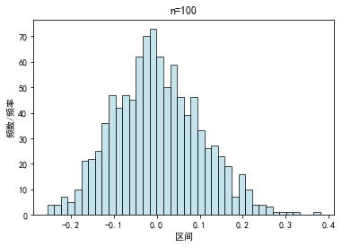
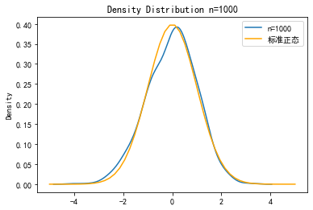

```python
import matplotlib, math, seaborn, pylab
import matplotlib.pyplot as plt
import pandas as pd
import numpy as np
import statsmodels.api as sm
import scipy.stats
import warnings
warnings.filterwarnings("ignore")  #忽略警告
matplotlib.rcParams['font.sans-serif']=['SimHei']   # 用黑体显示中文
matplotlib.rcParams['axes.unicode_minus']=False     # 正常显示负号
```

 

 

# 函数定义区

### 生成随机数


```python
def gene_unif(amount):  #生成随机均匀分布数组
    rand_vessel=np.zeros(shape=(999,amount))
    for row in range(999):
        temp_list=list()
        for column in range(int(amount)):
            temp_list.append(np.random.random())
        rand_vessel[row]=temp_list
        rand_df=pd.DataFrame(rand_vessel)
    return rand_df
```


```python
def gene_expon(amount):  #生成随机指数分布数组
    rand_vessel=np.zeros(shape=(999,amount))
    for row in range(999):
        temp_list=list()
        for column in range(int(amount)):
            temp_list.append(np.random.exponential(1))
        rand_vessel[row]=temp_list
        rand_df=pd.DataFrame(rand_vessel)
    return rand_df
```

### 绘图


```python
def plot_N():  #绘制标准正态分布
    mu = 0
    sigma = 1
    x = np.linspace(-5,5)   
    y=scipy.stats.norm().pdf(x)
    plt.plot(x,y,label='标准正态',color='orange')
```


```python
def plot_hisogram(datalist,dataname):  #绘制频数分布直方图
    matplotlib.rcParams['font.sans-serif']=['SimHei']   # 用黑体显示中文
    matplotlib.rcParams['axes.unicode_minus']=False     # 正常显示负号
    plt.hist(datalist, bins=40, density=0, facecolor="lightblue", edgecolor="black", alpha=0.7)
    plt.xlabel("区间")
    plt.ylabel("频数/频率")
    plt.title("n="+str(dataname))
    plt.savefig("n="+str(dataname))
    plt.show()
```

### Bootstrap相关


```python
def get_sample(rand_vessel):  #抽样获得一组sample，输入随机数df，返回取样dict
    sample={'10':[],'50':[],'100':[],'1000':[]}
    for key in rand_vessel.keys():  #生成sample,存入字典
        if key in sample.keys():
            rand_list=rand_vessel[key].sample(n=1,random_state=1)
            sample[key]=rand_list
    return sample
```


```python
def bootstrap(array, n):  #给定sample_array和抽样次数n，进行n次bootstrap抽样，最终返回n组 [bootstrap t统计量，X*bar-Xbar]
    bootstrap_t=list()
    non_pivotal=list()
    lenth=len(array)
    for i in range(int(n)):
        index_arr = np.random.randint(0, lenth, size=lenth)   
        data_sample = array[index_arr]          #进行一次抽样
        miu=np.mean(array)                      #获得sample_array的平均数
        mean_sample=np.mean(data_sample)        #获得bootstrap_array的平均数
        std_sample=np.std(data_sample)          #获得bootstrap_array的标准差
        t_sample=(mean_sample-miu)/(std_sample/math.sqrt(lenth))     #获得一个bootstrap t
        bootstrap_t.append(t_sample)
        non_pivotal.append(mean_sample-miu)
    return [bootstrap_t,non_pivotal]
```

### 数据处理


```python
def bandwidth(array):   #获得核密度估计带宽
    arr_std = np.std(array,ddof=1)
    h=1.06*arr_std*999**(-0.2)
    return h
```


```python
def mean_std(dic):   #求每一行的均值和标准差，返回df
    mean_vessel=pd.DataFrame(columns=('1','10','50','100','1000'))
    std_vessel=pd.DataFrame(columns=('1','10','50','100','1000'))
    for key in dic.keys():
        mean_list=dic[key].mean(axis=1)
        std_list=dic[key].std(axis=1)
        mean_vessel[key]=mean_list
        std_vessel[key]=std_list
    return [mean_vessel, std_vessel.drop('1',axis=1)]
```


```python
def t(mean,std,miu):   #求每一次的t值，返回4x999的df
    t_vessel=pd.DataFrame(columns=('10','50','100','1000'))
    for column in mean.columns:
        xbar_list=list()  #记录一列Xbar
        sigma_list=list()  #记录一列std
        t_list=list()  #记录一列t
        for xbar_row in mean.iterrows(): 
            xbar_list.append(xbar_row[1][column])
        for std_row in std.iterrows(): 
            sigma_list.append(std_row[1][column])
        for i in range(len(xbar_list)):
            X_bar=xbar_list[i]
            sigma=sigma_list[i]
            sqt=int(column)**0.5
            t=(X_bar-miu)/(sigma/sqt)
            t_list.append(t)
        t_vessel[column]=t_list
    return t_vessel
```

### 分位数


```python
def Quantile_N():  #获得标准正态分布分位数
    quantiles=dict()
    alphas=[0.005,0.025,0.05]
    for alpha in alphas:
        quantiles[str(alpha)]=scipy.stats.norm.ppf(alpha)
        quantiles[str(1-alpha)]=scipy.stats.norm.ppf(1-alpha)
    return quantiles
```


```python
def Quantile(array):  #获得任意分布的分位数
    quantiles=dict()
    alphas=[0.005,0.025,0.05]
    for alpha in alphas:
        quantiles[str(alpha)]=np.percentile(array, alpha)
        quantiles[str(1-alpha)]=np.percentile(array, 1-alpha)
    return quantiles
```

### 三种方法获得置信区间


```python
def CI1(amount,means,stds,quantiles):  #获得某个n值下的CI1
    CI1_vessel=pd.DataFrame(columns=('0.005','0.995','0.025','0.975','0.05','0.95'))
    for key in quantiles.keys():
        temp_list=list()
        for i in range(len(means)):
            xbar=means[i]
            sigma=stds[i]
            c=quantiles[key]
            point=xbar+c*sigma/(amount**0.5)
            temp_list.append(point)
        CI1_vessel[key]=temp_list
    return CI1_vessel
```


```python
def CI2(amount,means,stds,quantiles):  #获得某个n值下的CI2
    CI2_vessel=pd.DataFrame(columns=('0.005','0.995','0.025','0.975','0.05','0.95'))
    for key in quantiles.keys():
        temp_list=list()
        for i in range(len(means)):
            xbar=means[i]
            sigma=stds[i]
            c=quantiles[key]
            point=xbar+c*sigma/(amount**0.5)
            temp_list.append(point)
        CI2_vessel[key]=temp_list
    return CI2_vessel
```


```python
def CI3(means,quantiles):  #获得某个n值下的CI3
    CI3_vessel=pd.DataFrame(columns=('0.005','0.995','0.025','0.975','0.05','0.95'))
    for key in quantiles.keys():
        temp_list=list()
        for i in range(len(means)):
            xbar=means[i]
            c=quantiles[key]
            point=xbar+c
            temp_list.append(point)
        CI3_vessel[key]=temp_list
    return CI3_vessel
```

***

 

 

 

 

 

 

# 执行输出区


```python
#存入所有原始数据
rand_vessel={'1':gene_unif(1),'10':gene_unif(10),'50':gene_unif(50),'100':gene_unif(100),'1000':gene_unif(1000)}
mean_vessel=mean_std(rand_vessel)[0]
std_vessel=mean_std(rand_vessel)[1]
```

## 第一问

#### 获得频率分布直方图


```python
for i in range(5):
    mean_list=mean_vessel.iloc[:,i].to_list()
    mean_list[:] = [x - 0.5 for x in mean_list] 
    mean_name=mean_vessel.columns[i]
    plot_hisogram(mean_list,mean_name)
```


    

    


    

    


    

    


    

    


    

    


 

 

 

***

## 第二问

#### 获得t统计量


```python
t_vessel=t(mean_vessel.drop('1',axis=1),std_vessel,0.5)
t_vessel.to_csv('t_vessel.csv')
```

#### 绘制密度函数


```python
for i in range(4):
    t_list=t_vessel.iloc[:,i].to_list()
    label='n='+t_vessel.columns[i]  #图例标识
    band_width=bandwidth(t_list)
    seaborn.kdeplot(t_list,kernel='gau',legend=True,label=label,bw=band_width)
    plot_N()
    plt.legend()
    plt.title("Density Distribution n="+t_vessel.columns[i])
    plt.savefig(t_vessel.columns[i])
    plt.show()
```


    

    


    

    


    

    


    

    


 

 

 

 

#### 绘制qq plot


```python
for i in range(4):
    t_list=t_vessel.iloc[:,i].to_list()
    t_array=np.array(t_list, dtype = int)
    sm.graphics.qqplot(t_array,line='s')
```


    

    


    

    


    

    


    

    


 

 

 

 

***

## 第三问


```python
QN=Quantile_N()
key_list=['10','50','100','1000']
sample_dict=get_sample(rand_vessel)    #CI2相关
```

#### 计算CI1


```python
CI1_list=list()   #存储4个n下的999组置信区间
for i in range(4):
    means=mean_vessel.drop('1',axis=1).iloc[:,i].to_list()
    stds=std_vessel.iloc[:,i].to_list()
    CI1(int(key_list[i]),means,stds,QN).to_csv('CI1_n='+key_list[i]+".csv")
    CI1_list.append(CI1(int(key_list[i]),means,stds,QN))
CI1_list[3]
```


<div>
<style scoped>
    .dataframe tbody tr th:only-of-type {
        vertical-align: middle;
    }

    .dataframe tbody tr th {
        vertical-align: top;
    }

    .dataframe thead th {
        text-align: right;
    }
</style>
<table border="1" class="dataframe">
  <thead>
    <tr style="text-align: right;">
      <th></th>
      <th>0.005</th>
      <th>0.995</th>
      <th>0.025</th>
      <th>0.975</th>
      <th>0.05</th>
      <th>0.95</th>
    </tr>
  </thead>
  <tbody>
    <tr>
      <th>0</th>
      <td>0.496898</td>
      <td>0.544267</td>
      <td>0.502561</td>
      <td>0.538604</td>
      <td>0.505458</td>
      <td>0.535707</td>
    </tr>
    <tr>
      <th>1</th>
      <td>0.478542</td>
      <td>0.525300</td>
      <td>0.484132</td>
      <td>0.519711</td>
      <td>0.486992</td>
      <td>0.516850</td>
    </tr>
    <tr>
      <th>2</th>
      <td>0.480796</td>
      <td>0.528462</td>
      <td>0.486495</td>
      <td>0.522764</td>
      <td>0.489410</td>
      <td>0.519848</td>
    </tr>
    <tr>
      <th>3</th>
      <td>0.478580</td>
      <td>0.526908</td>
      <td>0.484358</td>
      <td>0.521130</td>
      <td>0.487314</td>
      <td>0.518174</td>
    </tr>
    <tr>
      <th>4</th>
      <td>0.479567</td>
      <td>0.526417</td>
      <td>0.485167</td>
      <td>0.520816</td>
      <td>0.488033</td>
      <td>0.517951</td>
    </tr>
    <tr>
      <th>...</th>
      <td>...</td>
      <td>...</td>
      <td>...</td>
      <td>...</td>
      <td>...</td>
      <td>...</td>
    </tr>
    <tr>
      <th>994</th>
      <td>0.463776</td>
      <td>0.510642</td>
      <td>0.469379</td>
      <td>0.505039</td>
      <td>0.472245</td>
      <td>0.502172</td>
    </tr>
    <tr>
      <th>995</th>
      <td>0.493446</td>
      <td>0.539627</td>
      <td>0.498966</td>
      <td>0.534106</td>
      <td>0.501791</td>
      <td>0.531282</td>
    </tr>
    <tr>
      <th>996</th>
      <td>0.466559</td>
      <td>0.513842</td>
      <td>0.472211</td>
      <td>0.508189</td>
      <td>0.475103</td>
      <td>0.505297</td>
    </tr>
    <tr>
      <th>997</th>
      <td>0.471980</td>
      <td>0.519340</td>
      <td>0.477641</td>
      <td>0.513678</td>
      <td>0.480538</td>
      <td>0.510781</td>
    </tr>
    <tr>
      <th>998</th>
      <td>0.480662</td>
      <td>0.528663</td>
      <td>0.486400</td>
      <td>0.522925</td>
      <td>0.489336</td>
      <td>0.519989</td>
    </tr>
  </tbody>
</table>
<p>999 rows × 6 columns</p>
</div>


#### 计算CI2


```python
CI2_list=list()   #存储4个n下的999组置信区间
for i in range(4):
    boot_t=bootstrap(np.array(sample_dict[key_list[i]].iloc[0].to_list(),dtype=float),999)[0]  #生成bootstrap t
    means=mean_vessel.drop('1',axis=1).iloc[:,i].to_list()
    stds=std_vessel.iloc[:,i].to_list()
    Qt=Quantile(boot_t)   #获得t的分位点
    CI2(int(key_list[i]),means,stds,Qt).to_csv('CI2_n='+key_list[i]+".csv")
    CI2_list.append(CI2(int(key_list[i]),means,stds,Qt))
CI2_list[3]
```


<div>
<style scoped>
    .dataframe tbody tr th:only-of-type {
        vertical-align: middle;
    }

    .dataframe tbody tr th {
        vertical-align: top;
    }

    .dataframe thead th {
        text-align: right;
    }
</style>
<table border="1" class="dataframe">
  <thead>
    <tr style="text-align: right;">
      <th></th>
      <th>0.005</th>
      <th>0.995</th>
      <th>0.025</th>
      <th>0.975</th>
      <th>0.05</th>
      <th>0.95</th>
    </tr>
  </thead>
  <tbody>
    <tr>
      <th>0</th>
      <td>0.492870</td>
      <td>0.500156</td>
      <td>0.493078</td>
      <td>0.500148</td>
      <td>0.493337</td>
      <td>0.500137</td>
    </tr>
    <tr>
      <th>1</th>
      <td>0.474566</td>
      <td>0.481759</td>
      <td>0.474771</td>
      <td>0.481750</td>
      <td>0.475028</td>
      <td>0.481740</td>
    </tr>
    <tr>
      <th>2</th>
      <td>0.476743</td>
      <td>0.484075</td>
      <td>0.476952</td>
      <td>0.484066</td>
      <td>0.477213</td>
      <td>0.484056</td>
    </tr>
    <tr>
      <th>3</th>
      <td>0.474471</td>
      <td>0.481904</td>
      <td>0.474683</td>
      <td>0.481896</td>
      <td>0.474947</td>
      <td>0.481885</td>
    </tr>
    <tr>
      <th>4</th>
      <td>0.475583</td>
      <td>0.482789</td>
      <td>0.475788</td>
      <td>0.482781</td>
      <td>0.476045</td>
      <td>0.482770</td>
    </tr>
    <tr>
      <th>...</th>
      <td>...</td>
      <td>...</td>
      <td>...</td>
      <td>...</td>
      <td>...</td>
      <td>...</td>
    </tr>
    <tr>
      <th>994</th>
      <td>0.459791</td>
      <td>0.466999</td>
      <td>0.459996</td>
      <td>0.466991</td>
      <td>0.460253</td>
      <td>0.466981</td>
    </tr>
    <tr>
      <th>995</th>
      <td>0.489519</td>
      <td>0.496622</td>
      <td>0.489721</td>
      <td>0.496614</td>
      <td>0.489974</td>
      <td>0.496604</td>
    </tr>
    <tr>
      <th>996</th>
      <td>0.462538</td>
      <td>0.469811</td>
      <td>0.462745</td>
      <td>0.469802</td>
      <td>0.463004</td>
      <td>0.469792</td>
    </tr>
    <tr>
      <th>997</th>
      <td>0.467952</td>
      <td>0.475237</td>
      <td>0.468160</td>
      <td>0.475229</td>
      <td>0.468419</td>
      <td>0.475218</td>
    </tr>
    <tr>
      <th>998</th>
      <td>0.476580</td>
      <td>0.483963</td>
      <td>0.476790</td>
      <td>0.483955</td>
      <td>0.477053</td>
      <td>0.483944</td>
    </tr>
  </tbody>
</table>
<p>999 rows × 6 columns</p>
</div>


#### 计算CI3


```python
CI3_list=list()   #存储4个n下的999组置信区间
for i in range(4):
    non_pivotal=bootstrap(np.array(sample_dict[key_list[i]].iloc[0].to_list(),dtype=float),999)[1]  #生成non_pivotal
    Qp=Quantile(non_pivotal)   #获得t的分位点
    means=mean_vessel.drop('1',axis=1).iloc[:,i].to_list()
    CI3(means,Qp).to_csv('CI3_n='+key_list[i]+".csv")
    CI3_list.append(CI3(means,Qp))
CI3_list[3]
```


<div>
<style scoped>
    .dataframe tbody tr th:only-of-type {
        vertical-align: middle;
    }

    .dataframe tbody tr th {
        vertical-align: top;
    }

    .dataframe thead th {
        text-align: right;
    }
</style>
<table border="1" class="dataframe">
  <thead>
    <tr style="text-align: right;">
      <th></th>
      <th>0.005</th>
      <th>0.995</th>
      <th>0.025</th>
      <th>0.975</th>
      <th>0.05</th>
      <th>0.95</th>
    </tr>
  </thead>
  <tbody>
    <tr>
      <th>0</th>
      <td>0.491154</td>
      <td>0.501628</td>
      <td>0.491873</td>
      <td>0.501586</td>
      <td>0.492772</td>
      <td>0.501534</td>
    </tr>
    <tr>
      <th>1</th>
      <td>0.472492</td>
      <td>0.482967</td>
      <td>0.473211</td>
      <td>0.482925</td>
      <td>0.474110</td>
      <td>0.482873</td>
    </tr>
    <tr>
      <th>2</th>
      <td>0.475200</td>
      <td>0.485675</td>
      <td>0.475919</td>
      <td>0.485633</td>
      <td>0.476818</td>
      <td>0.485580</td>
    </tr>
    <tr>
      <th>3</th>
      <td>0.473315</td>
      <td>0.483789</td>
      <td>0.474034</td>
      <td>0.483747</td>
      <td>0.474933</td>
      <td>0.483695</td>
    </tr>
    <tr>
      <th>4</th>
      <td>0.473563</td>
      <td>0.484037</td>
      <td>0.474282</td>
      <td>0.483995</td>
      <td>0.475181</td>
      <td>0.483943</td>
    </tr>
    <tr>
      <th>...</th>
      <td>...</td>
      <td>...</td>
      <td>...</td>
      <td>...</td>
      <td>...</td>
      <td>...</td>
    </tr>
    <tr>
      <th>994</th>
      <td>0.457780</td>
      <td>0.468254</td>
      <td>0.458499</td>
      <td>0.468212</td>
      <td>0.459398</td>
      <td>0.468160</td>
    </tr>
    <tr>
      <th>995</th>
      <td>0.487108</td>
      <td>0.497582</td>
      <td>0.487827</td>
      <td>0.497540</td>
      <td>0.488725</td>
      <td>0.497488</td>
    </tr>
    <tr>
      <th>996</th>
      <td>0.460771</td>
      <td>0.471245</td>
      <td>0.461490</td>
      <td>0.471204</td>
      <td>0.462389</td>
      <td>0.471151</td>
    </tr>
    <tr>
      <th>997</th>
      <td>0.466231</td>
      <td>0.476705</td>
      <td>0.466950</td>
      <td>0.476663</td>
      <td>0.467849</td>
      <td>0.476611</td>
    </tr>
    <tr>
      <th>998</th>
      <td>0.475234</td>
      <td>0.485708</td>
      <td>0.475953</td>
      <td>0.485666</td>
      <td>0.476851</td>
      <td>0.485614</td>
    </tr>
  </tbody>
</table>
<p>999 rows × 6 columns</p>
</div>


***

## 第四问


```python
expon_vessel={'1':gene_expon(1),'10':gene_expon(10),'50':gene_expon(50),'100':gene_expon(100),'1000':gene_expon(1000)}
expon_mean=mean_std(expon_vessel)[0]
expon_std=mean_std(expon_vessel)[1]
```

#### 获得频率分布直方图


```python
for i in range(5):
    mean_list=expon_mean.iloc[:,i].to_list()
    mean_list[:] = [x - 1 for x in mean_list] 
    mean_name=expon_mean.columns[i]
    plot_hisogram(mean_list,mean_name)
```


    

    


    

    


    

    


    

    


    

    


 

 

 

 

#### 获得t统计量


```python
expon_t=t(expon_mean.drop('1',axis=1),expon_std,1)
expon_t
```


<div>
<style scoped>
    .dataframe tbody tr th:only-of-type {
        vertical-align: middle;
    }

    .dataframe tbody tr th {
        vertical-align: top;
    }

    .dataframe thead th {
        text-align: right;
    }
</style>
<table border="1" class="dataframe">
  <thead>
    <tr style="text-align: right;">
      <th></th>
      <th>10</th>
      <th>50</th>
      <th>100</th>
      <th>1000</th>
    </tr>
  </thead>
  <tbody>
    <tr>
      <th>0</th>
      <td>-0.322458</td>
      <td>-1.725003</td>
      <td>-2.460717</td>
      <td>0.453974</td>
    </tr>
    <tr>
      <th>1</th>
      <td>1.318071</td>
      <td>-1.530621</td>
      <td>-0.406303</td>
      <td>0.043139</td>
    </tr>
    <tr>
      <th>2</th>
      <td>-0.953695</td>
      <td>-0.994001</td>
      <td>-0.031176</td>
      <td>-0.722321</td>
    </tr>
    <tr>
      <th>3</th>
      <td>-1.619885</td>
      <td>-0.571537</td>
      <td>0.123734</td>
      <td>-1.595757</td>
    </tr>
    <tr>
      <th>4</th>
      <td>1.327717</td>
      <td>-0.149042</td>
      <td>-0.481641</td>
      <td>-0.943790</td>
    </tr>
    <tr>
      <th>...</th>
      <td>...</td>
      <td>...</td>
      <td>...</td>
      <td>...</td>
    </tr>
    <tr>
      <th>994</th>
      <td>1.092928</td>
      <td>-1.400718</td>
      <td>-0.055558</td>
      <td>0.306141</td>
    </tr>
    <tr>
      <th>995</th>
      <td>-1.116962</td>
      <td>0.614307</td>
      <td>-0.610175</td>
      <td>-1.164613</td>
    </tr>
    <tr>
      <th>996</th>
      <td>-0.846500</td>
      <td>-1.606549</td>
      <td>0.705067</td>
      <td>0.660457</td>
    </tr>
    <tr>
      <th>997</th>
      <td>-2.176928</td>
      <td>0.963201</td>
      <td>-1.094334</td>
      <td>0.385910</td>
    </tr>
    <tr>
      <th>998</th>
      <td>-1.104775</td>
      <td>0.593605</td>
      <td>-2.231333</td>
      <td>-1.898784</td>
    </tr>
  </tbody>
</table>
<p>999 rows × 4 columns</p>
</div>


#### 绘制密度函数


```python
for i in range(4):
    expon_t_list=expon_t.iloc[:,i].to_list()
    label='n='+expon_t.columns[i]  #图例标识
    band_width=bandwidth(expon_t_list)
    seaborn.kdeplot(expon_t_list,kernel='gau',legend=True,label=label,bw=band_width)
    plot_N()
    plt.legend()
    plt.title("Density Distribution n="+expon_t.columns[i])
    plt.savefig(expon_t.columns[i])
    plt.show()
```


    

    


    

    


    

    


    

    


 

 

 

 

#### 绘制qq plot


```python
for i in range(4):
    expon_t_list=expon_t.iloc[:,i].to_list()
    expon_t_array=np.array(expon_t_list, dtype = int)
    sm.graphics.qqplot(expon_t_array,line='s')
```


    

    


    

    


    

    


    

    


 

#### 获得CI


```python
expon_sample_dict=get_sample(expon_vessel)    #CI2相关
expon_CI1_list=list()   #存储4个n下的999组置信区间
for i in range(4):
    means=expon_mean.drop('1',axis=1).iloc[:,i].to_list()
    stds=expon_std.iloc[:,i].to_list()
    CI1(int(key_list[i]),means,stds,QN).to_csv('CI1_n='+key_list[i]+".csv")
    expon_CI1_list.append(CI1(int(key_list[i]),means,stds,QN))
expon_CI1_list[3]
```


<div>
<style scoped>
    .dataframe tbody tr th:only-of-type {
        vertical-align: middle;
    }

    .dataframe tbody tr th {
        vertical-align: top;
    }

    .dataframe thead th {
        text-align: right;
    }
</style>
<table border="1" class="dataframe">
  <thead>
    <tr style="text-align: right;">
      <th></th>
      <th>0.005</th>
      <th>0.995</th>
      <th>0.025</th>
      <th>0.975</th>
      <th>0.05</th>
      <th>0.95</th>
    </tr>
  </thead>
  <tbody>
    <tr>
      <th>0</th>
      <td>0.930526</td>
      <td>1.099202</td>
      <td>0.950691</td>
      <td>1.079037</td>
      <td>0.961008</td>
      <td>1.068720</td>
    </tr>
    <tr>
      <th>1</th>
      <td>0.923234</td>
      <td>1.079381</td>
      <td>0.941901</td>
      <td>1.060714</td>
      <td>0.951452</td>
      <td>1.051163</td>
    </tr>
    <tr>
      <th>2</th>
      <td>0.899938</td>
      <td>1.056233</td>
      <td>0.918623</td>
      <td>1.037549</td>
      <td>0.928183</td>
      <td>1.027989</td>
    </tr>
    <tr>
      <th>3</th>
      <td>0.871034</td>
      <td>1.030299</td>
      <td>0.890073</td>
      <td>1.011260</td>
      <td>0.899815</td>
      <td>1.001518</td>
    </tr>
    <tr>
      <th>4</th>
      <td>0.891525</td>
      <td>1.050299</td>
      <td>0.910506</td>
      <td>1.031318</td>
      <td>0.920218</td>
      <td>1.021607</td>
    </tr>
    <tr>
      <th>...</th>
      <td>...</td>
      <td>...</td>
      <td>...</td>
      <td>...</td>
      <td>...</td>
      <td>...</td>
    </tr>
    <tr>
      <th>994</th>
      <td>0.923017</td>
      <td>1.097750</td>
      <td>0.943906</td>
      <td>1.076861</td>
      <td>0.954594</td>
      <td>1.066173</td>
    </tr>
    <tr>
      <th>995</th>
      <td>0.885796</td>
      <td>1.043088</td>
      <td>0.904599</td>
      <td>1.024284</td>
      <td>0.914220</td>
      <td>1.014663</td>
    </tr>
    <tr>
      <th>996</th>
      <td>0.938555</td>
      <td>1.103819</td>
      <td>0.958312</td>
      <td>1.084062</td>
      <td>0.968421</td>
      <td>1.073954</td>
    </tr>
    <tr>
      <th>997</th>
      <td>0.934070</td>
      <td>1.089167</td>
      <td>0.952611</td>
      <td>1.070626</td>
      <td>0.962098</td>
      <td>1.061139</td>
    </tr>
    <tr>
      <th>998</th>
      <td>0.870104</td>
      <td>1.019654</td>
      <td>0.887982</td>
      <td>1.001776</td>
      <td>0.897130</td>
      <td>0.992629</td>
    </tr>
  </tbody>
</table>
<p>999 rows × 6 columns</p>
</div>


```python
expon_CI2_list=list()   #存储4个n下的999组置信区间
for i in range(4):
    boot_t=bootstrap(np.array(expon_sample_dict[key_list[i]].iloc[0].to_list(),dtype=float),999)[0]  #生成bootstrap t
    means=expon_mean.drop('1',axis=1).iloc[:,i].to_list()
    stds=expon_std.iloc[:,i].to_list()
    Qt=Quantile(boot_t)   #获得t的分位点
    CI2(int(key_list[i]),means,stds,Qt).to_csv('CI2_n='+key_list[i]+".csv")
    expon_CI2_list.append(CI2(int(key_list[i]),means,stds,Qt))
expon_CI2_list[3]
dir(expon_CI2_list)
```


    ['__add__',
     '__class__',
     '__contains__',
     '__delattr__',
     '__delitem__',
     '__dir__',
     '__doc__',
     '__eq__',
     '__format__',
     '__ge__',
     '__getattribute__',
     '__getitem__',
     '__gt__',
     '__hash__',
     '__iadd__',
     '__imul__',
     '__init__',
     '__init_subclass__',
     '__iter__',
     '__le__',
     '__len__',
     '__lt__',
     '__mul__',
     '__ne__',
     '__new__',
     '__reduce__',
     '__reduce_ex__',
     '__repr__',
     '__reversed__',
     '__rmul__',
     '__setattr__',
     '__setitem__',
     '__sizeof__',
     '__str__',
     '__subclasshook__',
     'append',
     'clear',
     'copy',
     'count',
     'extend',
     'index',
     'insert',
     'pop',
     'remove',
     'reverse',
     'sort']


```python
expon_CI3_list=list()   #存储4个n下的999组置信区间
for i in range(4):
    expon_non_pivotal=bootstrap(np.array(expon_sample_dict[key_list[i]].iloc[0].to_list(),dtype=float),999)[1]  #生成non_pivotal
    Qp=Quantile(expon_non_pivotal)   #获得t的分位点
    means=expon_mean.drop('1',axis=1).iloc[:,i].to_list()
    CI3(means,Qp).to_csv('CI3_n='+key_list[i]+".csv")
    expon_CI3_list.append(CI3(means,Qp))
expon_CI3_list[3]
```


<div>
<style scoped>
    .dataframe tbody tr th:only-of-type {
        vertical-align: middle;
    }

    .dataframe tbody tr th {
        vertical-align: top;
    }

    .dataframe thead th {
        text-align: right;
    }
</style>
<table border="1" class="dataframe">
  <thead>
    <tr style="text-align: right;">
      <th></th>
      <th>0.005</th>
      <th>0.995</th>
      <th>0.025</th>
      <th>0.975</th>
      <th>0.05</th>
      <th>0.95</th>
    </tr>
  </thead>
  <tbody>
    <tr>
      <th>0</th>
      <td>0.939115</td>
      <td>0.953754</td>
      <td>0.939168</td>
      <td>0.953277</td>
      <td>0.939234</td>
      <td>0.952680</td>
    </tr>
    <tr>
      <th>1</th>
      <td>0.925559</td>
      <td>0.940197</td>
      <td>0.925611</td>
      <td>0.939720</td>
      <td>0.925677</td>
      <td>0.939124</td>
    </tr>
    <tr>
      <th>2</th>
      <td>0.902337</td>
      <td>0.916976</td>
      <td>0.902389</td>
      <td>0.916498</td>
      <td>0.902455</td>
      <td>0.915902</td>
    </tr>
    <tr>
      <th>3</th>
      <td>0.874918</td>
      <td>0.889556</td>
      <td>0.874970</td>
      <td>0.889079</td>
      <td>0.875036</td>
      <td>0.888483</td>
    </tr>
    <tr>
      <th>4</th>
      <td>0.895163</td>
      <td>0.909802</td>
      <td>0.895216</td>
      <td>0.909325</td>
      <td>0.895282</td>
      <td>0.908729</td>
    </tr>
    <tr>
      <th>...</th>
      <td>...</td>
      <td>...</td>
      <td>...</td>
      <td>...</td>
      <td>...</td>
      <td>...</td>
    </tr>
    <tr>
      <th>994</th>
      <td>0.934635</td>
      <td>0.949274</td>
      <td>0.934687</td>
      <td>0.948796</td>
      <td>0.934753</td>
      <td>0.948200</td>
    </tr>
    <tr>
      <th>995</th>
      <td>0.888693</td>
      <td>0.903332</td>
      <td>0.888745</td>
      <td>0.902854</td>
      <td>0.888811</td>
      <td>0.902258</td>
    </tr>
    <tr>
      <th>996</th>
      <td>0.945438</td>
      <td>0.960077</td>
      <td>0.945491</td>
      <td>0.959600</td>
      <td>0.945557</td>
      <td>0.959004</td>
    </tr>
    <tr>
      <th>997</th>
      <td>0.935869</td>
      <td>0.950508</td>
      <td>0.935922</td>
      <td>0.950031</td>
      <td>0.935988</td>
      <td>0.949435</td>
    </tr>
    <tr>
      <th>998</th>
      <td>0.869130</td>
      <td>0.883769</td>
      <td>0.869183</td>
      <td>0.883292</td>
      <td>0.869249</td>
      <td>0.882696</td>
    </tr>
  </tbody>
</table>
<p>999 rows × 6 columns</p>
</div>


```python

```
